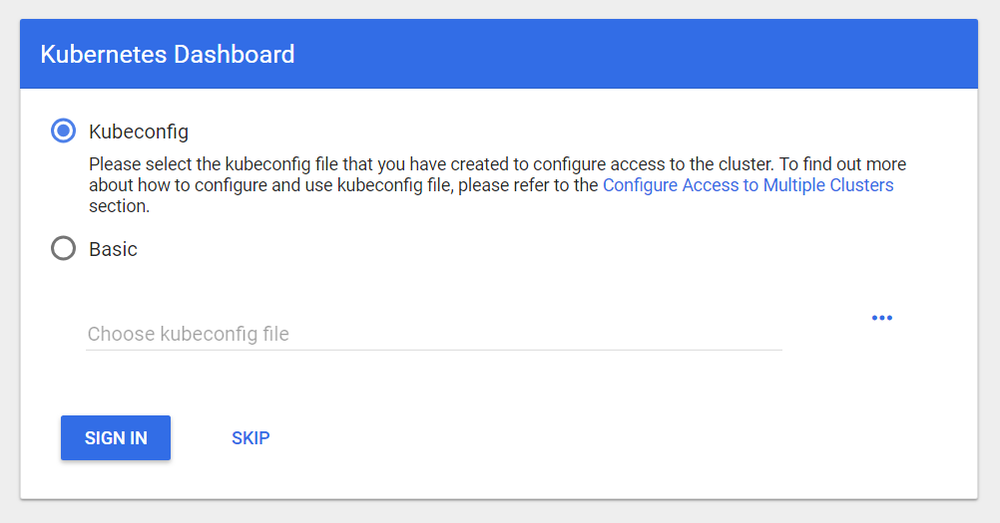

# How to access the dashboard as a trainer with the master kubeconfig

## Building the dashboard url:

`https://api.<cluster-name>.<project-name>.shoot.canary.k8s-hana.ondemand.com/api/v1/namespaces/kube-system/services/https:kubernetes-dashboard:/proxy`

The connection is insecure because the certificate is not signed by an trusted authority. Accept it anyways. 

## Reading the access credentials out of the kubeconfig

Cou get the master kubeconfig after cluster generation. Look for the following section in there:

```
- name: shoot-k8s-train-ccdev01-basic-auth
  user:
    username: admin
    password: <access password>
```

This contains the username and password to access the dashboard.

When you gained access to the dashboard, on the following screen press skip. Now you can use the dashboard.


