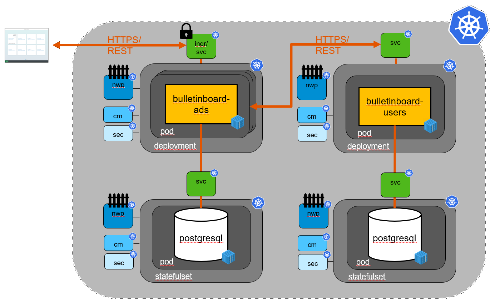

xxx

## [Exercise "Setup Bulletinboard-Ads Database"](/exercise_01_ads_db.md)
- Create all required entities for ads DB: configmap-init, configmap, secret and service
- Create a statefull set for the ads DB

## Setup Bulletinboard-Ads Application
- Create required configmap and deployment for ads
- Publish ads via service and ingress
- Check Ads running properly together with Ads DB (e.g. create ads via postman, display list of ads in browser, ...)

## Increase security via Networkpolicies & TLS for Bulletinboard-Ads and -DB
- Increase security and establish a network policy for
  - Ads DB
  - Ads

## Using Users Helm-chart to setup Bulletinboard-Users Application and -Database
- Create Users DB and Users Ads via existing helm chart

## (OPTIONAL) Create Helm chart for Bulletinboard-Ads Application and -DB
- Develop a Helm chart for Ads Db and Ads App

