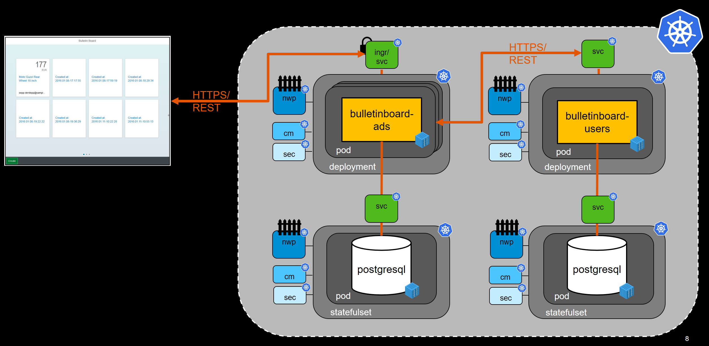

xxx

<<<<<<< HEAD
img src="images/bulletinbaord-target-picture-detail-2.png" width="800" />
=======

>>>>>>> b15edcea9a96e2eaeab810304568c5fd6ac20051

## Ads DB
- Create all required entities for ads DB: configmap-init, configmap, secret and service
- Create a statefull set for the ads DB

## Ads App
- Create required configmap and deployment for ads
- Publish ads via service and ingress
- Check Ads running properly together with Ads DB (e.g. create ads via postman, display list of ads in browser, ...)

## Networkpolicies for Ads and DB
- Increase security and establish a network policy for
  - Ads DB
  - Ads

## Users DB + Users App
- Create Users DB and Users Ads via existing helm chart

## Optional - Ads DB + Ads App Helm chart
- Develop a Helm chart for Ads Db and Ads App

