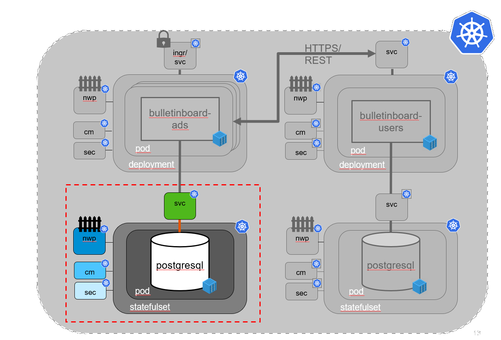
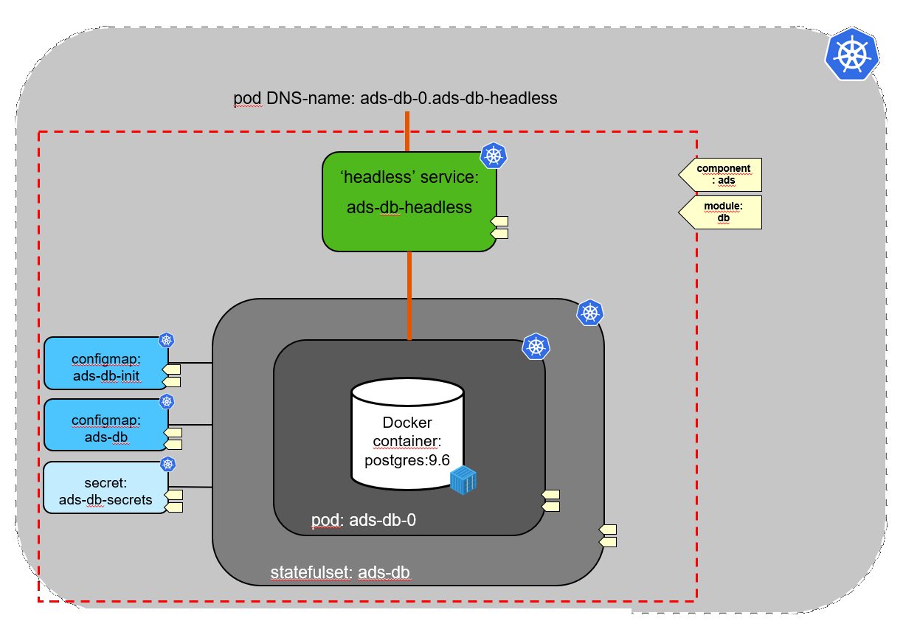
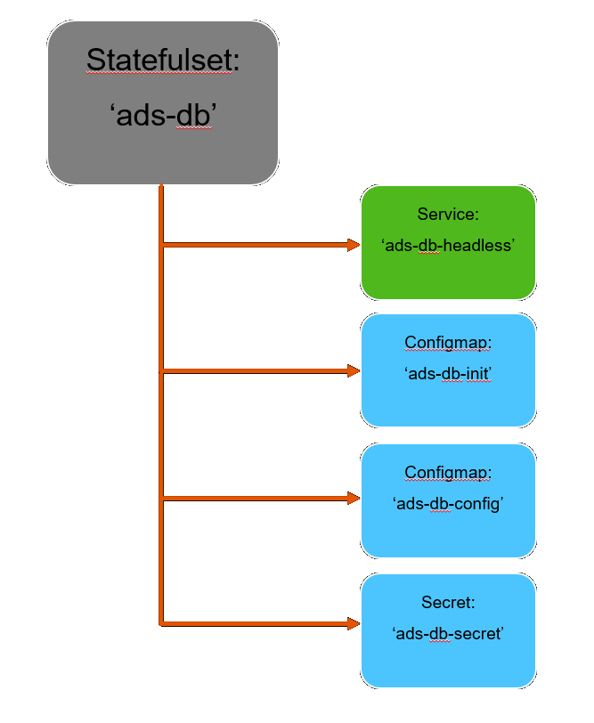

# - 2. PILOT in CW46 - !

# Exercise: Setup Bulletinboard-Ads Database


## Scope

- In this first exercise we will focus on the **setup of Bulletinboard-Ads Database**, where the Bulletinboard-Ads Microservice can store the advertisements (See picture below).



- As we do not need horizontal scaling for the database (by our assumned requirements) we will use a **Statefulset** (instead of a K8s deployment) with only one instance (replica count=1).

- As database we will use Postgresql, where on Docker hub we can find a well suiting offical [Postgresql Docker image](https://hub.docker.com/_/postgres/).

- The Postgresql Docker image gives us the possibility to override several default values via **environment variables** for e.g. the location for the database files (`PGDATA`) and the superuser password (`POSTGRES_PASSWORD`). (Information needed in step 5)

- As well we can run any **initdb scripts**, which we will use to create a new database with a specific user and password (Not using the default user postgres).

- In order to make available the Bulletinboard-Ads Database **Pod** we have to setup a **"headless" service** to allow the app to talk to the database.

## Labels

We make us of labels on **all** entities so they can be easier selected/searched for with kubectl. 

- The structure for **Labels** (and with this for **Selectors**) has 2 levels. On the first level we want to separate **Bulletinboard-Ads** from **Bulletinboard-Users**. For this we introduce the **Label** `component` with value `ads` or `users`. On the second level we separate the App-part from the Database-part within each "Component". Here we introduce the **Label** `module` with value `app` or `db`. 

This hierarchy allows us to retrieve e.g all entities for our databases via a `kubectl get deploy,sts,pods,cm,secrets,svc -l module=db`, or for ads with `kubectl get deploy,sts,pods,cm,secrets,svc -l component=ads`.

- To shorten names, entities will be referenced by their component & module values, like __ads:app__ to name e.g. the pod(s) for bulletinboard-ads application pod.




## Step 0: Preparation

**Please, before you start with this exercises, clean up your namespace from what you did the previous days by deleting all deployments, statefulsets, pvcs, services etc.** This helps you by easier finding the entities in your namespace and us by reducing the load on the cluster!

- Create a folder `k8s-bulletinboard` in your home directory for the various yaml-files, you will create in the exercises.
- Create a sub-folder `ads` for all yaml-files, related to **Bulletinboard-Ads** (App/Microservice + DB).

## Step 1: Create a Configmap with location of Postgres database files

- Specify a **Configmap** `ads-db-configmap` with a data item for the new location of the Postgresql database files: `/var/lib/postgresql/data/pgdata` with key `pgdata_value` and save the **Configmap** spec under the filename `ads-db-configmap.yaml` in folder `k8s-bulletinboard/ads`. Do not forget to specify proper labels for [component and module](exercise_01_ads_db.md#labels)!

- Now call `kubectl apply -f ads-db-configmap.yaml` to create the **Configmap**.

## Step 2: Create a Secret to initialize the database

- Use the following sql script to create a new database `adsuser` and a specific user `adsuser` with password `initial`. 
  You can change the password (in line 3) to something else, however we will need it in Exercise 2&5 too, so remember it. 
  Since the file contains censitive data like password, we will store it as a generic **secret**. First save this script in an `initdb.sql` named file.

 ```
 -- This is a postgres initialization script for the postgres container. 
 -- Will be executed during container initialization ($> psql postgres -f initdb.sql)
 CREATE ROLE adsuser WITH LOGIN PASSWORD 'initial' INHERIT CREATEDB;
 CREATE DATABASE ads WITH ENCODING 'UNICODE' LC_COLLATE 'C' LC_CTYPE 'C' TEMPLATE template0;
 GRANT ALL PRIVILEGES ON DATABASE ads TO adsuser;
 CREATE SCHEMA ads AUTHORIZATION adsuser;
 -- ALTER DATABASE ads SET search_path TO 'ads';
 ALTER DATABASE ads OWNER TO adsuser;
```

- Because the data in a **Secret** is base64 encoded we will use *kubectl* itself to generate the yaml: 

```
 kubectl create secret generic ads-db-secret --from-file initdb.sql --dry-run -o yaml > ads-db-secret.yaml
```

- Because of the `--dry-run` parameter this will only generate a yaml and does not create the **Secret** itself. 

- Now open the file `ads-db-secret.yaml` and add the proper labels for [component and module](exercise_01_ads_db.md#labels). Also remove the `creationTimestamp`. Save the changes.

- Add top level entry `type: Opaque`.

- Now call `kubectl apply -f ads-db-secret.yaml` to create the **Secret**.

## Step 3: Secret for Postgres Superuser Password

Purpose: Create a **Secret** with password for Postgres superuser

We could create a 2nd **Secret** for this. Yet, we will instead add this info to the above **Secret** so we have less files and entities on kubernetes. 
- Open the file `ads-db-secret.yaml` and add a data item with key `postgres_password_value` and with a value of your choice which will become the PostgreSQL master password. You will have to base64 encode the password before entering it into the YAML file.  
You can take any String as a master password, but if you want a random string you could do e.g. `openssl rand -base64 15 | base64` which will already give you a random already encoded password. (The first `-base64` option is used to only have alphanumerics (almost) in the password). Save the file `ads-db-secret.yaml`.

- Now call `kubectl apply -f ads-db-secret.yaml` to update the **Secret** with the 2nd data item.

## Step 4: "Headless" Service
Purpose: Create the **"headless" Service**, required to access the pod, created by the statefulset.

- Specify a **"headless" Service** `ads-db-service` with proper labels and selector for [component and module](exercise_01_ads_db.md#labels). Use the default port, given by the Docker image (port 5432 as depicted by the description on [Docker Hub](https://hub.docker.com/_/postgres/)) and make sure you are using a named port. Save the service under the filename `ads-db-service.yaml` in folder `k8s-bulletinboard/ads`.

- Now call `kubectl apply -f ads-db-service.yaml` to create the **"headless" Service**.

> [Hint](https://github.wdf.sap.corp/slvi/docker-k8s-training/blob/extend_helm/kubernetes/exercise_07_statefulset.md#step-0-create-a-headless-service)

## Step 5: Statefulset

Purpose: Create the **Statefulset**, which uses both Configmaps, the Secret and the "headless" Service, created in step 1-4 (Creation of Statefulset will fail, if those entities are not yet available !).



_Hint: In the following sections we will provide you yaml-snippets of the Statefulset specification. Just substitute the place holders `<...>` by proper values !_

- Specify a **Statefulset** for the Postgres Database Pod with name `ads-db-statefulset` with proper labels and selector for [component and module](exercise_01_ads_db.md#labels). 

```
---
apiVersion: apps/v1
kind: StatefulSet
metadata:
  name: <name-of-statefulset>
  labels:
    component: <name-of-component>
    module: <name-of-module>
```

- Refer to the "headless" service, created earlier and make sure that only one DB pod gets created. 
- Additional refer under `volumes` to the secret item with database initialization script and refer to the configmap and right secret item when setting up Postgres environment variables in the Docker container.

```
spec:
  serviceName: <name-of-headless-service
  replicas: <#-of-DB-pods>
  selector:
    matchLabels:
      component: <name-of-component>
      module: <name-of-module>
  template:
    metadata:
      labels:
        component: <name-of-component>
        module: <name-of-module>
    spec:
      volumes:
      - name: init
        secret:
          secretName: <name-of-secret>
          items:
          - key: <key-name-of-INITDB.SQL-file>
            path: initdb.sql
      containers:
      - name: ads-db-container
        image: postgres:9.6
        ports:
        - containerPort: 5432
          name: ads-db-port
        volumeMounts:
        - name: ads-db-volume
          mountPath: /var/lib/postgresql/data/
        - name: init
          mountPath: /docker-entrypoint-initdb.d/
        env:
        - name: <postgres-environment-variable-for-path-of-datebase-files>
          valueFrom:
            configMapKeyRef:
              name: <name-of-configmap>
              key: <name-of-data-specified-in-configmap>
        - name: <postgres-environment-variable-for-superuser-password>
          valueFrom:
            secretKeyRef:
              name: <name-of-secret>
              key: <name-of-data-specified-in-secret>
```

- For the creation of the PVC we are using the volumeClaimTemplates mechanism. Here just make sure you are using proper labels for [component and module](exercise_01_ads_db.md#labels). 

```
  volumeClaimTemplates:
  - metadata:
      name: ads-db-volume
      labels:
        component: <name-of-component>
        module: <name-of-module>
    spec:
      accessModes: [ "ReadWriteOnce" ]
      resources:
        requests:
          storage: 1Gi
```

- When you are ready with the specification of the **Statefulset** save it under the filename `ads-db-statefulset.yaml` in folder `k8s-bulletinboard/ads` and call `kubectl apply -f ads-db-statefulset.yaml` to create the **Statefulset** `ads-db-statefulset`.

- After successful creation of the **Statefulset** check, whether the **Pod** `ads-db-statefulset-0` got created properly  via `kubectl get pod ads-db-statefulset-0` or in more detail via `kubectl describe pod ads-db-statefulset-0` . Also check whether the Database is ready to be connected via `kubectl logs ads-db-statefulset-0`. There should be the line: `LOG:  database system is ready to accept connections` in the logs. 


## Optional- Step 6: Detailled Check whether Pod with Postgres DB is running properly

Purpose: check whether the database is running and accepting connections. Use the [**pgadmin tool**](https://www.pgadmin.org/) for that.

Here are two different ways how you could test if the statefulset is configured correctly and the db intialized with the right user and password:

### Using a temporary postgres pod and psql

Create a temporary pod with psql installed (e.g. a postgres:9.6 image like our DB) and use psql from this pod to connect to the DB.

```
kubectl run tester -it --rm --image=postgres:9.6 --env="PGCONNECT_TIMEOUT=5" --command -- bash
```

A promt with root@... should come up. You are now connected to the pod, here we can use psql to try to connect to our ads-db:
`psql -h ads-db-statefulset-0.ads-db-service -p 5432 -U adsuser -W ads`. You will be ask for the adsuser pw (you defined that in the initdb.sql script, should be `initial` if you have not changed it). After this you should connect to the ads db, a promt `ads=>` will ask you for the next command. If this does, all is correctly set up!  
Type `\q` to quit psql since we only wanted to test that we can connect. Also exit the pod with the `exit` command. The pod should be automatically removed after this. 

### Using port-forward and pgadmin in the VM


- Install **pgadmin** locally on your virtual machine. For the training virtual machine, use the following command to install the software: `sudo apt install pgadmin3`

- Use `kubectl port-forward ads-db-statefulset-0 5432:5432` to forward the database port from the database pod of your statefulset to your local virtual machine. 

- With e.g. **pgadmin**, connect to the forwarded database port on your `localhost` and supply the credentials for the user that got created on the database by the initialization script. If the login succeeds, your database is up and running and this part of the exercise is complete.
