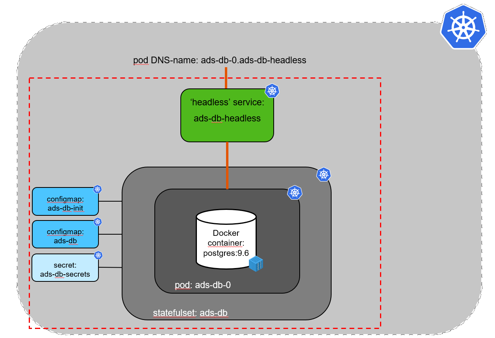

# Exercise: Setup Bulletinboard-Ads Database


## Scope

- In this first exercise we will focus on the **setup of Bulletinboard-Ads Database**, where the Bulletinboard-Ads Microservice can store the advertisements (See picture below).


- As we do not need horizontal scaling for the database we will use a **Statefulset** (instead of a K8s deployment) with only one instance (replicaset=1).

- As database we will use Postgresql, where on Docker hub we can find a well suiting offical [Postgresql Docker image](https://hub.docker.com/_/postgres/).

- The Postgresql Docker image gives us the possibility to override several default values via **environment variables** for e.g. the location for the database files (`PGDATA`) and the superuser password (`POSTGRES_PASSWORD`).

- As well we can run any **initdb scripts**, which we will use to create a new database with a specific user and password (Not using the default user postgres).

- To make available the Bulletinboard-Ads Database **Pod** from "outside" we have to provide a **"headless" Service**.



- The structure for **Labels** (and with this for **Selectors**) has 2 levels. To separate **Bulletinboard-Ads** from **Bulletinboard-Users** we introduce the **Label** `component` with value `ads` and `users`. To separate the App-part from the Database-part within each "Component" we introduce the **Label** `module` with value `app` and `db`.


## Step 0: Preparation

- Create a folder `k8s-bulletinboard` in your home directory for the various yaml-files, you will create in the exercises.
- Create a sub-folder `ads` for all yaml-files, related to **Bulletinboard-Ads** (App/Microservice + DB).

## Step 1: Create a Configmap to initialize the database

- Use the following sql script to create a new database `adsuser` and a specific user `adsuser` with password `initial`.

 ```
 -- This is a postgres initialization script for the postgres container. Execute it with psql as:
 -- $> psql postgres -f initdb.sql
 CREATE ROLE adsuser WITH LOGIN PASSWORD 'initial' INHERIT CREATEDB;
 CREATE DATABASE ads WITH ENCODING 'UNICODE' LC_COLLATE 'C' LC_CTYPE 'C' TEMPLATE template0;
 GRANT ALL PRIVILEGES ON DATABASE ads TO adsuser;
 CREATE SCHEMA ads AUTHORIZATION adsuser;
 -- ALTER DATABASE ads SET search_path TO 'ads';
 ALTER DATABASE ads OWNER TO adsuser;
```

- Specify a **Configmap** 'ads-db-init' (incl. proper labels for component and module) and store above sql script under the data section with name `initdb.sql` and save the **Configmap** spec under the filename `ads-db-configmap-init.yaml` in folder `k8s-bulletinboard/ads`.

- Now call `kubectl apply -f ads-db-configmap-init.yaml` to create the **Configmap**.


## Step 2: Create a Configmap with location of Postgres database files

- Specify a **Configmap** `ads-db-config` with an environment variable `PGDATA` for the new location of the Postgresql database files: `/var/lib/postgresql/data/pgdata` and save the **Configmap** spec under the filename `ads-db-configmap.yaml` in folder `k8s-bulletinboard/ads`. Do not forget to specify proper labels for component and module !

- Now call `kubectl apply -f ads-db-configmap.yaml` to create the **Configmap**.


## Step 3: Secret

Purpose: Create a Secret with password for Postgres superuser

- Specify a **Secret** `ads-db-secrets` of type `opaque` with an environment variable `PG_PASSWORD`, with a random value e.g. `ajZia0U0TXdtY3hmdk9UdWU0eVpYaHQK`. ToDO: tool/ command ? Ask Hendrik/ Thomas ? and save the **Secret** under the filename `ads-db-secrets.yaml` in folder `k8s-bulletinboard/ads`. Do not forget to specify proper labels for component and module !

- Now call `kubectl apply -f ads-db-secret.yaml` to create the **Secret**.


## Step 4: "Headless" Service
Purpose: Create the **"headless" Service**, required to access the pod, created by the statefulset.

- Specify a **"headless" Service** `ads-db-service` with proper labels and selector for component and module. Use the default port, given by the Docker image, make shure you are using a named port and save it under the filename `ads-db-service.yaml` in folder `k8s-bulletinboard/ads`.

- Now call `kubectl apply -f ads-db-service.yaml` to create the **"headless"Service**.

## Step 5: Statefulset

Purpose: Create the **Statefulset**, which is dependend on both Configmaps, the Secret and the "headless" Service, created in step 1-4 (Creation of Statefulset will fail, if those entities are not yet available !).


_Hint: In the following sections we will provide you yaml-snippets of the Statefulset specification. Just substitute the place holders `<...>` by proper values !_

- Specify a **Statefulset** for the Postgres Database Pod with name `ads-db` with proper labels and selector for component and module. 

```
---
apiVersion: apps/v1
kind: StatefulSet
metadata:
  name: <name-of-statefulset>
  labels:
    component: <name-of-component>
    module: <name-of-module>
```

- Refer to the "headless" service, created earlier and make shure that only one DB pod gets created. 
- Additional refer under `volumes` to the configmap with database initialization script and refer to the configmap and secret when exposing Postgres environment variables in the Docker container.

```
spec:
  serviceName: <name-of-headless-service
  replicas: <#-of-DB-pods>
  selector:
    matchLabels:
      component: <name-of-component>
      module: <name-of-module>
  template:
    metadata:
      labels:
        component: <name-of-component>
        module: <name-of-module>
    spec:
      volumes:
      - name: init
        configMap:
          name: <name-of-configmap-init>
      containers:
      - name: ads-db
        image: postgres:9.6
        ports:
        - containerPort: 5432
          name: ads-db
        volumeMounts:
        - name: ads-db-volume
          mountPath: /var/lib/postgresql/data/
        - name: init
          mountPath: /docker-entrypoint-initdb.d/
        env:
        - name: <postgres-environment-variable-for-path-of-datebase-files>
          valueFrom:
            configMapKeyRef:
              name: <name-of-configmap>
              key: <name-of-data-specified-in-configmap>
        - name: <postgres-environment-variable-for-superuser-password>
          valueFrom:
            secretKeyRef:
              name: <name-of-secret>
              key: <name-of-data-specified-in-secret>
```

- For the creation of the PVC we are using the volumeClaimTemplates mechanism. Here just make shure you are using proper labels for component and module. 

```
  volumeClaimTemplates:
  - metadata:
      name: ads-db-volume
      labels:
        component: <name-of-component>
        module: <name-of-module>
    spec:
      accessModes: [ "ReadWriteOnce" ]
      resources:
        requests:
          storage: 1Gi
```

- When you are ready with the specification of the **Statefulset** save it under the filename `ads-db.yaml` in folder `k8s-bulletinboard/ads` and call `kubectl apply -f ads-db.yaml` to create the **Statefulset** `ads-db`.

- After successful creation of the **Statefulset** check, wether the **Pod** `ads-db-0` got created properly the Database is ready to be connected via `kubectl get ads-db-0` or in more detail via `kubectl describe pod ads-db-0`. 


## Optional- Step 6: Detailled Check wether Pod with postgres DB is running properly
- ToDO ...
- Local Port-Forwarding + PGAdmin tool to check database and user available


