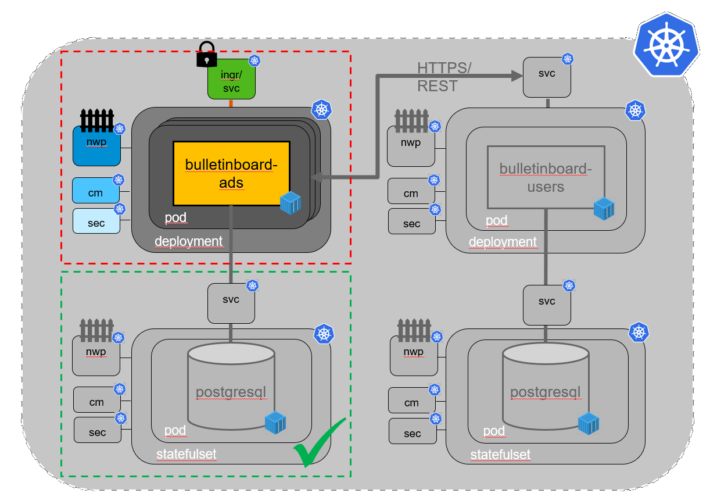
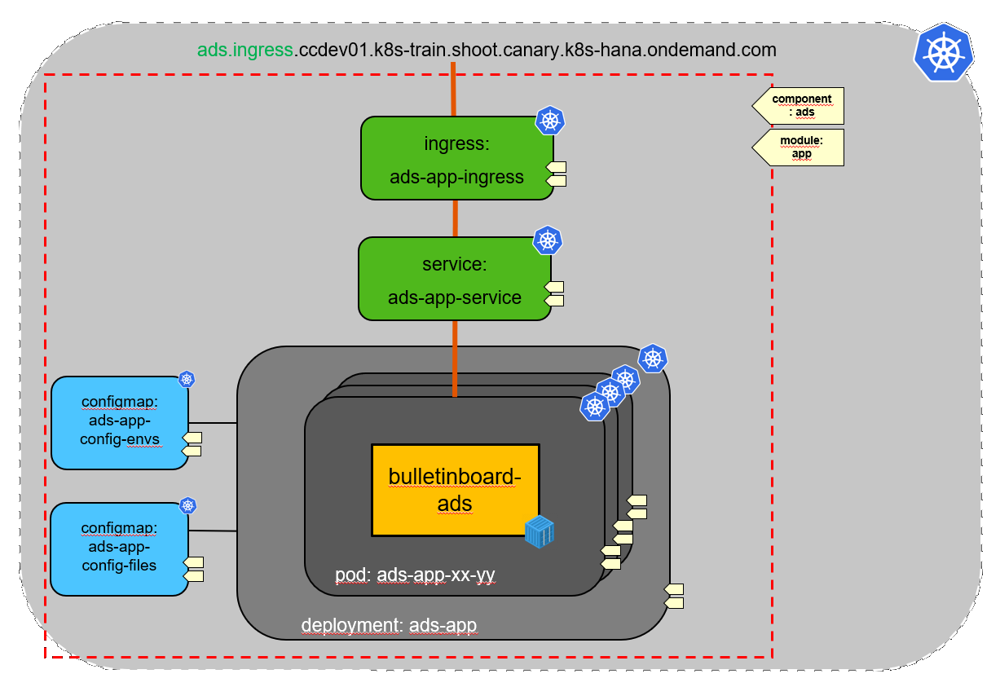
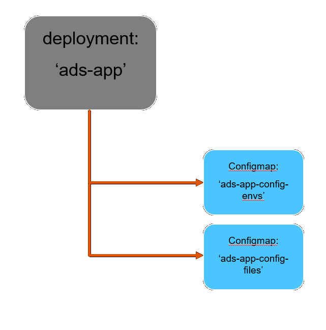
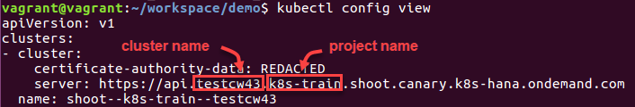
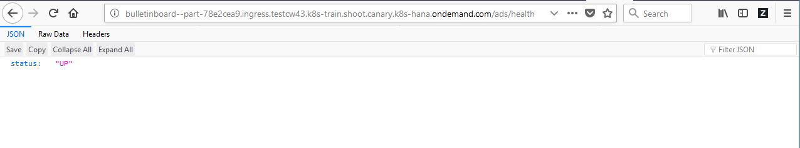
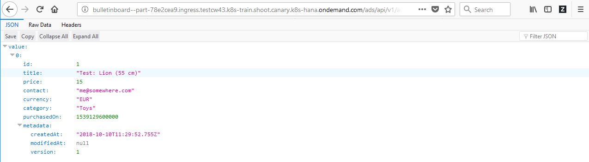
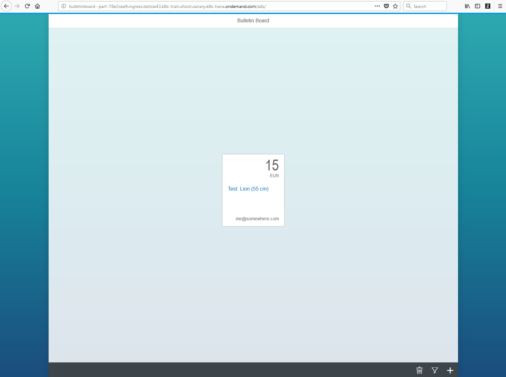

# - 2. PILOT in CW46 - !

# Exercise: Setup Bulletinboard-Ads Microservice/ Application


## Scope

- In this second exercise we will focus on the setup of **Bulletinboard-Ads Application/Microservice** itself (Ads:App) and make it available within a K8s cluster via a **Service** and publish externally/ into the Internet via an **Ingress** (See picture below).

- Finally we will check **Ads App** running properly together with **Ads DB** (e.g. create advertisements via postman, display list of ads in browser, ...)



- We decided our initial exepected load to **Ads App** requires at least 2 instances of our **Ads App**. Therefore we need horizontal scaling for the **Ads App**, which we provide using a **Deployment** with 2 instances (replicas is 2).

- A specific version of Cloud Curriculum **Bulletinboard-Ads**, slighty adapted for this training, is available as [Docker Image](https://docker.repositories.sap.ondemand.com/webapp/#/artifacts/browse/tree/General/cc-k8s-course/k8s/bulletinboard-ads/latest) in [**SAP Artifactory in DMZ**](https://docker.repositories.sap.ondemand.com/webapp/#/home).

- **Bulletinboard-Ads** is a **Spring Boot** application and can read [configuration from various external sources](https://docs.spring.io/spring-boot/docs/current/reference/html/boot-features-external-config.html). The Docker Image of **Bulletinboard-Ads** is reading the configuration from an **Application properties file** with name `application-k8s.yml`.

- Additional we can configure **Bulletinboard-Ads** via environment variables for de-/activation of a check against **Bulletinboard-Users** when creating an advertisement (`POST_USER_CHECK`), the Service-URL to the **Bulletinboard-Users** (`USER_ROUTE`) and the [Active Spring Profile](https://docs.spring.io/spring-boot/docs/current/reference/html/howto-properties-and-configuration.html#howto-set-active-spring-profiles) (`SPRING_PROFILES_ACTIVE`).

- The structure for **Labels** (and with this for **Selectors**) has 2 levels as in exercice 1: To separate **Bulletinboard-Ads** from **Bulletinboard-Users** we introduce the **Label** `component` with value `ads` and `users`. To separate the App-part from the Database-part within each "Component" we introduce the **Label** `module` with value `app` and `db`.



## Step 0: ImagePullSecret for SAP artifactory repo cc-k8s-course

Purpose: The Dockerimage for Bulletinboard-ads is pushed to the [**SAP Artifactory DMZ**](https://docker.repositories.sap.ondemand.com/webapp/#/home). To retrieve it from there you need the corresponding credentials (user/password) and 'location'/ repository in SAP Artifactory DMZ ([cc-k8s-course.docker.repositories.sap.ondemand.com](https://docker.repositories.sap.ondemand.com/webapp/#/artifacts/browse/tree/General/cc-k8s-course)) and provide these to K8s when creating **Ads App**.

- To create a docker-registry **Secret** named _artifactory_ by executing the command below (Using the prepared credentials):

```
kubectl create secret docker-registry artifactory --docker-server=cc-k8s-course.docker.repositories.sap.ondemand.com --docker-username=cc-k8s-course-r1 --docker-password=oQHCMaS05Z1i
```
- We will uses the **Secret** name to identify in the **Deployment** what ImagePullSecret to use.

## Step 1: Secret for Application properties file

Purpose: Create a **Secret** for the external (outside the docker image) configuration of **ads:app**, which will be the **Application properties file** `application-k8s.yml`. Since the file will contain sensitive data like passwords, etc. we use a **Secret** instead of a **Configmap**.

- The content of the file - finally created at the filesystem of the Docker Container - should look like the following:

```
spring: 
  datasource: 
    url: jdbc:postgresql://<name-of-ads-db-pod>.<name-of-ads-db-headless-service>:5432/ads
    username: <name-of-ads-db-postgres-user> 
    password: <password-of-ads-db-postgres-user> 
    driverClassName: org.postgresql.Driver
```

_**Hint: Please substitute the place holders below <...> by proper values !**_

- Save the file under the filename `application-k8s.yml` in folder `k8s-bulletinboard/ads`.

- Because the data in a **Secret** is base64 encoded we will use *kubectl* itself to generate the yaml for the **Secret** itself: 

```
 kubectl create secret generic ads-app-secret --from-file application-k8s.yml --dry-run -o yaml > ads-app-secret.yaml
```

- Because of the `--dry-run` parameter this will only generate a yaml and does not create the **Secret** itself. 

- Now open the file `ads-app-secret.yaml` and add the proper *labels* for component and module. Add `type: Opaque` and also remove the `creationTimestamp`. Save the changes. 

- Now call `kubectl apply -f ads-app-secret.yaml` to create the **Secret**.

_Further informations on [Configmap from files](https://kubernetes.io/docs/tasks/configure-pod-container/configure-pod-configmap/#create-configmaps-from-files)_

## Step 2: Configmap for Spring Profile 

Purpose: Create a **Configmap** for the external (outside the docker image) configuration of **ads:app**, which will be the environment variable SPRING_PROFILES_ACTIVE, we want to "pass" to **Bulletinboard-Ads** Docker container.

- The app needs to get specified which profile **Spring** should use. We will use the name **k8s** for the profile (thus the name application-__k8s__.yml). One way **Spring** gets this information is by providing an environment variable `SPRING_PROFILES_ACTIVE` in the Dockercontainer. 

- Therefore specify a **Configmap** `ads-app-configmap` with key `spring_profiles_active_value` and value `k8s`.

- By default this specific version of **Bulletinboard-Ads** does not check against **Bulletinboard-Users** when creating an advertisement. Anyhow a **Bulletinboard-Users** App is not yet available/ running in our K8s Cluster (Will be done in [Exercise 04](exercise_04_users_app_and_db_by_helm.md)). Therefore we do not need to specify/ "pass" the environment variables `POST_USER_CHECK` and `USER_ROUTE` now.

- Save the **Configmap** spec under the filename `ads-app-configmap.yaml` in folder `k8s-bulletinboard/ads`. Do not forget to specify proper labels for component and module !

- Now call `kubectl apply -f ads-app-configmap.yaml` to create the **Configmap**.

_Further informations on [Configmap and Container Environment Variables](https://kubernetes.io/docs/tasks/configure-pod-container/configure-pod-configmap/#define-container-environment-variables-using-configmap-data)_

## Step 3: Deployment

Purpose: Create the **Deployment**, which is dependend on the **Configmap** and **Secret**, created in step 1 (Creation of Deployment will fail, if those are not yet available !). Also the **Secret** `artifactory` is needed to pull the image.



_Hint: In the following sections we will provide you several yaml-snippets of the Deployment specification. Just substitute the place holders `<...>` by proper values !_

- Specify a **Deployment** for the **Bulletinboard Ads** with 2 instances, with name `ads-app-deployment` and with proper labels and selector for component and module. 

```
---
apiVersion: apps/v1
kind: Deployment
metadata:
  name: ads-app-deployment
  labels:
    component: <name-of-component>
    module: <name-of-module>
spec:
  replicas: <#-of-instances>
  selector:
    matchLabels:
      component: <name-of-component>
      module: <name-of-module>
```

- Assign to the volume `ads-app-properties` from the **Secret** the key for the **Applicaton Properties file** and choose as Docker container the **Bulletinboard-Ads** Docker Image:  
```
cc-k8s-course.docker.repositories.sap.ondemand.com/k8s/bulletinboard-ads:latest
```

- Addtional refer for the environment variable `STRING_PROFILES_ACTIVE` the corresponding **Configmap** (key & name).

```  
  template:
    metadata:
      labels:
        component: <name-of-component>
        module: <name-of-module>
    spec:
      volumes:
      - name: ads-app-properties
        secret:
          secretName: <name-of-secret>
          items:
          - key: <name-of-the-key-with-the-file-content>
            path: application-k8s.yml
      imagePullSecrets:
      - name: artifactory
      containers:
      - name: ads
        image: <bulletinboard-ads-docker-image>
        ports:
        - containerPort: 8080
          name: ads-app-port
        env:
        - name: SPRING_PROFILES_ACTIVE
          valueFrom:
            configMapKeyRef:
              key: <name-of-data-specified-in-configmap>
              name: <name-of-configmap>
        volumeMounts:
        - mountPath: /config/
          name: ads-app-properties
        resources:
          limits:
            memory: 1Gi
          requests:
            memory: 800Mi
```
- We also add a specific resource request for this app. The default memory-limit in each trainings namespace is 500Mi which is not enough for a spring boot application. We request 800Mi and allow an increase to 1G of Memory to be consumed by each pod. 

- When you are ready with the specification of the **Deployment** save it under the filename `ads-app-deployment.yaml` in folder `k8s-bulletinboard/ads` and call `kubectl apply -f ads-app-deployment.yaml` to create the **Deployment** `ads-app-deployment`.

- After successful creation of the **Deployment** check, wether **2** Pods got created properly via `kubectl get pods`. The names of the 2 pods should be something like `ads-app-deployment-xx-yx` and `ads-app-deployment-xx-yy`.


## Step 4: Service & Ingress

Purpose: Make **Bulletinboard-Ads** available within your K8s Cluster via **Service** and "publish" externally into the Internet via a **Ingress**.

_Hint: In the following sections we will provide you yaml-snippets of the Deployment specification. Just substitute the place holders `<...>` by proper values !_

### Service

- Specify a **Service** for the **Bulletinboard Ads**, with name `ads-app-service`, a named targetPort `ads-app-port` and with proper labels and selector for component and module. 


```
---
apiVersion: v1
kind: Service
metadata:
  name: ads-app-service
  labels:
    component: <name-of-component>
    module: <name-of-module>
spec:
  ports:
  - port: 8080
    protocol: TCP
    targetPort: ads-app-port
  selector:
    component: <name-of-component>
    module: <name-of-module>
  type: ClusterIP
```
- When you are ready with the specification of the **Service** save it under the filename `ads-app-service.yaml` in folder `k8s-bulletinboard/ads` and call `kubectl apply -f ads-app-service.yaml` to create the **Service** `ads-app-service`.

### Ingress

- Additional specify an **Ingress** for the **Bulletinboard Ads**, with name `ads-app-ingress` and with proper labels and selector for component and module. 

- As the host URL has to be unique across the whole K8s Cluster, add `--<name-of-your-namespace>` as suffix to the hostname 'bulletinboard', so the host URL would look like: `bulletinboard--part-40a86f44.ingress.testcw43.k8s-train.shoot.canary.k8s-hana.ondemand.com`.

- Refer to the above created **Service** `ads-app-service` in field `serviceName` and `servicePort` (Section '- backend').

```
---
apiVersion: extensions/v1beta1
kind: Ingress
metadata:
  name: ads-app-ingress
  labels:
    component: <name-of-component>
    module: <name-of-module>
  annotations:
    nginx.ingress.kubernetes.io/rewrite-target: /
spec:
  rules:
  - host: bulletinboard--<your-name-space>.ingress.<your-trainings-cluster>.<your-project-name>.shoot.canary.k8s-hana.ondemand.com
    http:
      paths: 
      - path: /ads
        backend:
          serviceName: <name-of-ads-service>
          servicePort: <name-of-ads-port>
```
  In the examble above the namespace would be `part-40a86f44`, cluster name would be `testcw43` and project name would be `k8s-train`.
  You can find out what your *cluster name* and *project name* is by looking into the config: `kubectl config view`. Here `clusters.cluster.server` contains the api url, which contains both cluster and project name. You can see an example in the picture below.  
  

- When you are ready with the specification of the **Ingress** save it under the filename `ads-app-ingress.yaml` in folder `k8s-bulletinboard/ads` and call `kubectl apply -f ads-app-ingress.yaml` to create the **Ingress** `ads-app-ingress`.

- Check wether the **Ingress** is properly created via `kubectl get ingress ads-app-ingress`.

- Additional check wether you can call your **Bulletinboard-Ads** on the `/ads/health` endpoint via the **Ingress** Url with the following **cURL** command:

`curl http://bulletinboard--<your-name-space>.ingress.<your-trainings-cluster>.k8s-train.shoot.canary.k8s-hana.ondemand.com/ads/health`.

- If all works fine, you should get the following result: `{"status":"UP"}`


## Step 5: Check proper working Ads App with Ads DB

Purpose: Check **Bulletinboard-Ads** App running properly together with **Bulletinboard-Ads** database with Postman and Browser/ Web-UI

### Postman

- List and create advertisements with [Postman](helper_ads_app_postman.md)

### Browser/ Web-UI

Now, access the application using the browser.
- Open Chromium browser
- Open a new tab
- Paste the following URLs into the adress field and check the results.
  - **REST API, health Endpoint**: `http://bulletinboard--<your-name-space>.ingress.<your-trainings-cluster>.k8s-train.shoot.canary.k8s-hana.ondemand.com/ads/health`
  - **REST API, Get All**: `http://bulletinboard--<your-name-space>.ingress.<your-trainings-cluster>.k8s-train.shoot.canary.k8s-hana.ondemand.com/ads/api/v1/ads`
  - **REST API, Get Single**: `http://bulletinboard--<your-name-space>.ingress.<your-trainings-cluster>.k8s-train.shoot.canary.k8s-hana.ondemand.com/ads/api/v1/ads/<advertisement-id>`
  - **Web-UI**: `http://bulletinboard--<your-name-space>.ingress.<your-trainings-cluster>.k8s-train.shoot.canary.k8s-hana.ondemand.com/ads/`
  





