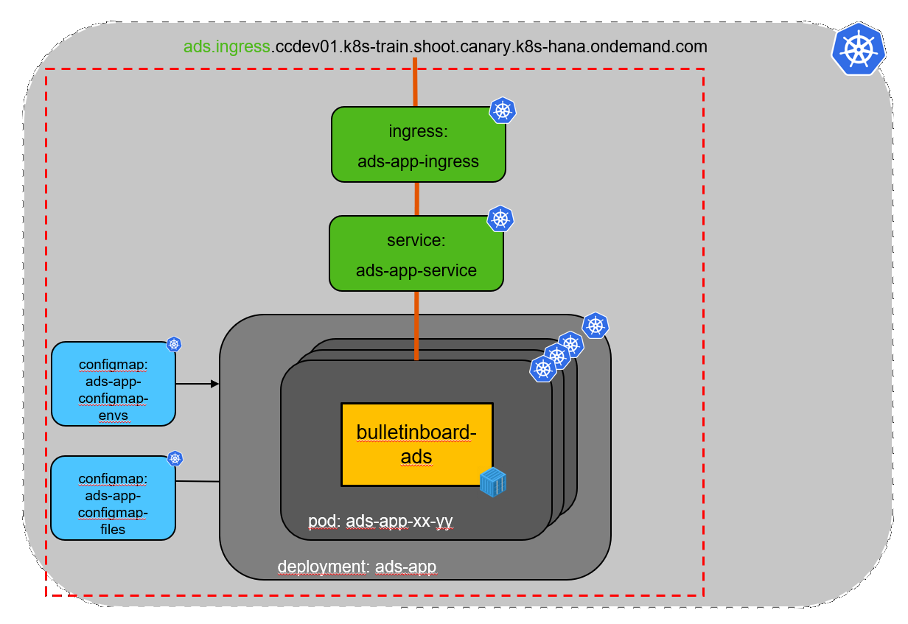

# Exercise: Setup Bulletinboard-Ads Microservice/ Application


## Scope

- In this second exercise we will focus on the setup of **Bulletinboard-Ads Application/Microservice** itself (See picture below) and make it available within the K8s cluster via **Service** and publish externally via an **Ingress**.
- Finally we will check Ads running properly together with Ads DB (e.g. create ads via postman, display list of ads in browser, ...)


- As we need horizontal scaling for the Ads app we will use a **Deployment** with 3 instances (replicaset=3).

- A specific version of **Bulletinboard-Ads**, slighty adapted for this training, is available as [Docker Image](https://docker.repositories.sap.ondemand.com/webapp/#/artifacts/browse/tree/General/cc-k8s-course/k8s/bulletinboard-ads/latest) in **SAP Artifactory in DMZ**.

- **Bulletinboard-Ads** is a **Spring Boot** application and can read [configuration from various external sources](https://docs.spring.io/spring-boot/docs/current/reference/html/boot-features-external-config.html). The Docker Image of **Bulletinboard-Ads** is reading the configuration from an **Application properties file** with name `application-k8s.yml`.

- Additional we can configure **Bulletinboard-Ads** via environment variables for de-/activation of a check against **Bulletinboard-Users** when creating an advertisement (`POST_USER_CHECK`), the Ingress-URL to the **Bulletinboard-Users** (`USER_ROUTE`) and the [Active Spring Profile](https://docs.spring.io/spring-boot/docs/current/reference/html/howto-properties-and-configuration.html#howto-set-active-spring-profiles) (`SPRING_PROFILES_ACTIVE`).





## Step 1: Configmap for Application properties file

Purpose: Create a **Configmap** for the **Application properties file**.

- Specify a **Configmap** `ads-app-config-files` for the **Application properties file** with name `application-k8s.yml`.

- The content of the file - finally created at the filesystem of the Docker Container (ToDO: better Pod ? or PV or PVC ?)- should look like the following:

```
---
spring: 
  datasource: 
    url: jdbc:postgresql://<name-of-ads-db-pod>.<name-of-ads-db-headless-service>:5432/ads
    username: <name-of-ads-db-postgres-user> 
    password: <password-of-ads-db-postgres-user> 
    driverClassName: org.postgresql.Driver
    driver-class-name: org.postgresql.Driver
```

- The specification in the **Configmap** should look like following. Please be aware, that you have to build up a proper yaml structure with new lines and correct indends. New lines can be done with `\n` and indends with ` `:
```
---
apiVersion: v1
kind: ConfigMap
metadata:
  name: ads-app-config-files
  labels:
    component: <name-of-component>
    module: <name-of-module>
data:
application-k8s.yml: "---\nspring:\n  datasource:\n    url: jdbc:postgresql://<name-of-ads-db-pod>.<name-of-ads-db-headless-service>:5432/ads\n    username: <name-of-ads-db-postgres-user>\n    password: <password-of-ads-db-postgres-user>\n    driverClassName: org.postgresql.Driver\n    driver-class-name: org.postgresql.Driver\n"
```

**_Hint: Please substitute the place holders below <...> by proper values !_**

- Save the **Configmap** spec under the filename `ads-app-configmap-files.yaml` in folder `k8s-bulletinboard/ads`. Do not forget to specify proper labels for component and module !

- Now call `kubectl apply -f ads-app-configmap-files.yaml` to create the **Configmap**.


## Step 2: Configmap for Environment variables

Purpose: Create a **Configmap** for environment variables, we want to "pass" to **Bulletinboard-Ads**.

- Specify a **Configmap** `ads-app-config-envs` with data entry `spring_profiles_active_value` and value `k8s` for the **Active Spring Profile**.

- By default **Bulletinboard-Ads** does not check against **Bulletinboard-Users** when creating an advertisement. Anyhow a **Bulletinboard-Users** App is not yet available/ running in our K8s Cluster (Will be done in [Exercise 03](exercise_03_ads_app_and_db_networkpolicy.md)). Therefor we do not need to specify/ "pass" the environment variables `POST_USER_CHECK` and `USER_ROUTE` now.

- Save the **Configmap** spec under the filename `ads-app-configmap-envs.yaml` in folder `k8s-bulletinboard/ads`. Do not forget to specify proper labels for component and module !

- Now call `kubectl apply -f ads-db-configmap-envs.yaml` to create the **Configmap**.


## Step 3: Deployment

Purpose: 
- xx

kubectl apply -f ads-app.yaml 

## Step 4: Service & Ingress

Purpose: 
- Publish ads via service and ingress

kubectl apply -f ads-app-service.yaml 
kubectl apply -f ads-app-ingress.yaml

## Step 5: Check proper working ads app with ads DB

Purpose:

- xxx


- Publish ads via service and ingress
- Check Ads running properly together with Ads DB (e.g. create ads via postman, display list of ads in browser, ...)

