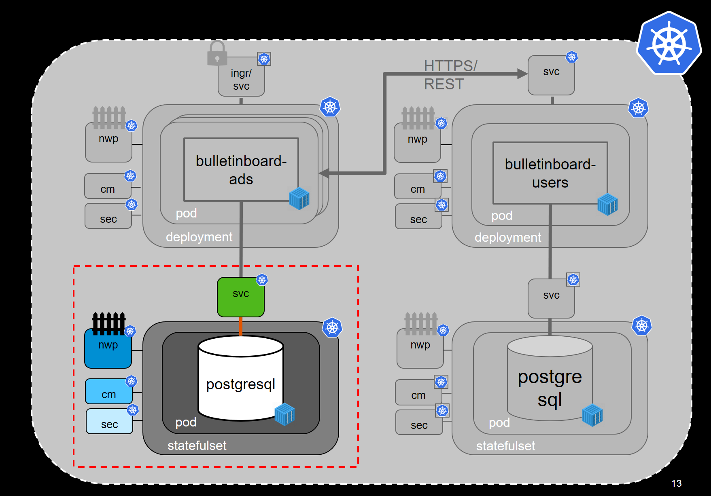

# Exercise: xxx

## Scope

Create a statefull set for the ads DB 

kubectl apply -f ads-db.yaml 

https://hub.docker.com/_/postgres/

img src="images/xxx.png" width="800" />

## Step 0: prerequisites
xxx

## Step 1: xxx
xx

## Step 2: xxx
xxx

## Step 3: xxx
xx

