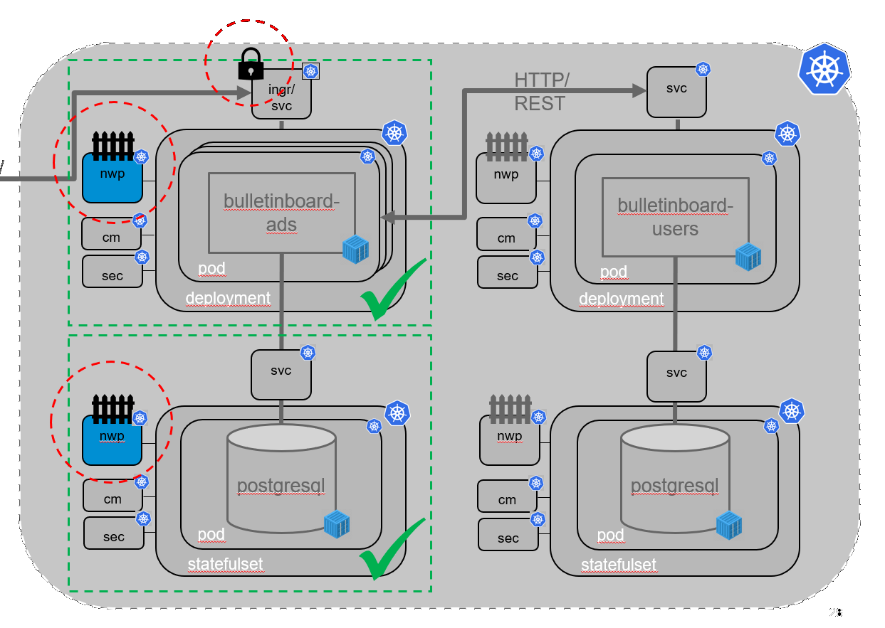
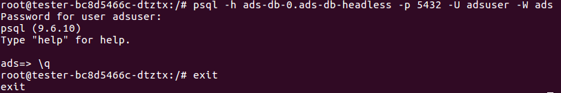
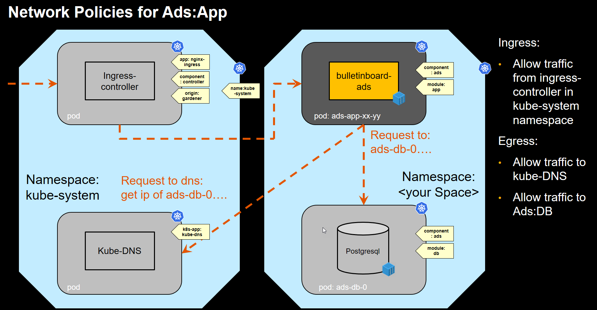
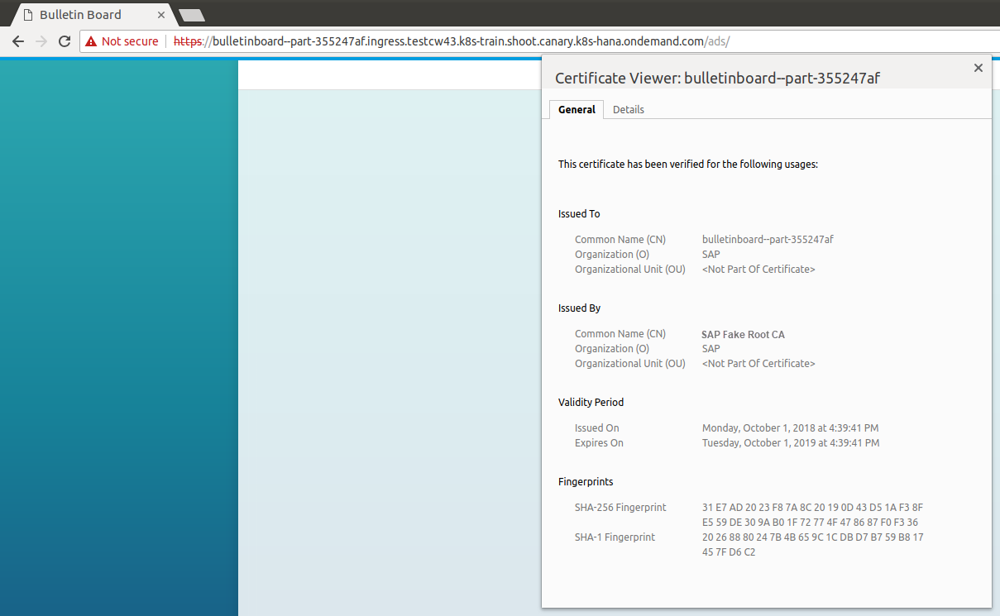

# - 2. PILOT in CW46 - !

# Exercise: Secure your connections


## Scope

Increase security by **establishing a network policy** for Ads DB and **enable TLS** (https) for the **Ingress** for Ads App. 



## Step 0: prerequisites

Test that the kube-system namespace has the proper label: 
```bash
$ kubectl get namespaces --show-labels | grep system
kube-system     Active    20d       name=kube-system
```
If the last value is `<none>` your kube-system namespace is missing the label. In this case talk to the trainers that it gets the label.

## Step 1: Network policy for DB

__Purpose: control traffic to and from *ads:db* pod__ 

<p align="center"></p>

We want only that  __ads:db__ only takes messages from __ads:app__. Configure a network policy in a file named `ads-db-networkpolicy.yaml` accordingly. 
You can check the [network policy exercise](../exercise_08_network_policy.md) and [this reference](https://kubernetes.io/docs/concepts/services-networking/network-policies/) on how to write a network policy.  
Also we want to block all outgoing traffic by denying all egress traffic. You can see [here how to do so](https://github.com/ahmetb/kubernetes-network-policy-recipes/blob/master/11-deny-egress-traffic-from-an-application.md).

<details> <summary>If you need further hints here is a skeleton network policy!</summary>
<p>

```yaml
kind: NetworkPolicy
apiVersion: networking.k8s.io/v1
metadata:
  name: ads-db-networkpolicy
  labels:
    <proper-component-module-labels>
spec:
  podSelector:
    matchLabels:
      <labels-for-targeted-entities>
  policyTypes:
  - Ingress
  - Egress  
  ingress:
  - from:
    - podSelector:
        matchLabels:
        <incoming pods labels>
  egress: []
```

</p>
</details>

### Testing of the implemented policy

To test the ingress rule, restart one of your __ads:app__ pods (delete it, the deployment will create a new one). If it comes up the app can still connect to the DB. 
You can also test it by creating a temporary pod with psql installed (e.g. a postgres:9.6 image like our DB) and use psql from this pod to connect to the DB. First we will use the right labels:
```
kubectl run --restart=Never -it --rm --image=postgres:9.6 --labels="component=ads,module=app" --env="PGCONNECT_TIMEOUT=5" helper --command -- /bin/bash
```

A prompt with root@... should come up. You are now connected to the pod, here we can use psql to try to connect to our ads-db:
`psql -h ads-db-statefulset-0.ads-db-service -p 5432 -U adsuser -W ads`. You will be ask for the adsuser pw (you defined that in the initdb.sql script, should be `initial`). After this you should connect to the ads db, a prompt `ads=>` will ask you for the next command. Type `\q` to quit psql since we only wanted to test that we can connect. Also exit the pod with the `exit` command.

<p align="center"></p>

To test that no one else can connect, change the labels in the kubectl command to anything different (or just leave them out) and repeat the steps above: `kubectl run tester -it --rm --image=postgres:9.6 --env="PGCONNECT_TIMEOUT=5" --command -- bash`. Again you should get a root prompt, execute `psql -h ads-db-statefulset-0 -p 5432 -U adsuser -W ads` which, after you entered the password, should return with `timeout expired` after 5 seconds.

To test the egress `kubectl exec -it ads-db-statefulset-0 bash` and try to ping any page/pod e.g. ads:app. 

## Step 2: Network policy for Ads

__Purpose: control traffic to and from *ads:app* pod, learn how to select a pod in a different namespace in your policy__ 

<p align="center"></p>

We want that __ads:app__ only takes messages from the ingress. 
The ingress controller is in the `kube-system` namespace and has the following labels you can use: 
```
app: nginx-ingress 
component: controller 
origin: gardener
```
Futher we can also allow  __ads:app__ to send traffic only to certian pods. This would currently be __ads:db__ and the dns server in our cluster. This dns server is also in the `kube-system` namespace and has a label `k8s-app: kube-dns`. 

Configure a network policy in a file named `ads-app-networkpolicy.yaml` accordingly.  
Hints: [this example](https://github.com/ahmetb/kubernetes-network-policy-recipes/blob/master/07-allow-traffic-from-some-pods-in-another-namespace.md) and the egress rules. (See above reference and [here](https://kubernetes.io/docs/reference/generated/kubernetes-api/v1.11/#networkpolicyspec-v1-networking-k8s-io)). 

Again test the policy, first by restarting ads, and then creating an ads with the UI or Postman/curl to the ingress address. 

## Step 3: TLS

We also want to enable TLS for our communication with ads. Therefore we activate TLS on our ingress service. 
Because we use the ingress we can not just follow the steps of the [configmap and secrets](../exercise_06_configmaps_secrets.md) exercise to optain the key and certificate files and create the tls-secret. The certificate has to have the url in it, and it is to long to just put it in the CN (63 Char limit) field. 
Create a `tls` subfolder in the `ads` folder: `mkdir tls; cd tls`
We will first create our own Root certificate:
```
openssl genrsa -out ca.key 2048
openssl req -new -x509 -days 365 -key ca.key -subj "/C=DE/L=Walldorf/O=SAP/CN=SAP Fake Root CA" -out ca.crt
```
Now use this ca.crt to sign the server certificate: Please change the `/CN` field to fit your namespace, also add the complete ingress url at `<THE INGRESS ULR>`. You can change the `/C` and `/L` to fit your location if you want.
```
openssl req -newkey rsa:2048 -nodes -keyout server.key -subj "/C=DE/L=Walldorf/O=SAP/CN=bulletinboard--<namespace>" -out server.csr
openssl x509 -req -extfile <(printf "subjectAltName=DNS:<THE INGRESS URL WITHOUT HTTP(S)://>") -days 365 -in server.csr -CA ca.crt -CAkey ca.key -CAcreateserial -out server.crt
```
Finally create the tls secret yaml, move it into the ads folder and apply it:
```
kubectl create secret tls ingress-tls-sec --cert=server.crt --key=server.key --dry-run -o yaml > tls.yaml
cd ..; mv tls/tls.yaml .
kubectl apply -f tls.yaml
``` 
With this we can change `spec:` of ingress in the yaml to the following (added the last 2 lines) and apply the change:
```
spec:
  rules:
  - host: <THE INGRESS URL>
    http:
      paths:
      - backend:
          serviceName: ads-service
          servicePort: ads-app
  tls:
  - secretName: ingress-tls-sec
```
Now we have enabled https connection for the ingress and therefore also for the ads service behind the ingress.
Open `https://<firstpart of url>.ingress.<clustername>.<projectname>.shoot.canary.k8s-hana.ondemand.com/` and after the warning that the certificate is insecure you can use the UI with https. 
To check that everything worked check out the certificate you get when opening the url, it should look like this:  
<p align="center"></p>

## Troubleshooting

- decoding the server.csr to see if the namespace is correctly put in: `openssl req -in mycsr.csr -noout -text`
- decoding the server.crt to see if the "Subject Alternative Name DNS" entry is correct: `openssl x509 -in server.crt -text -noout`


