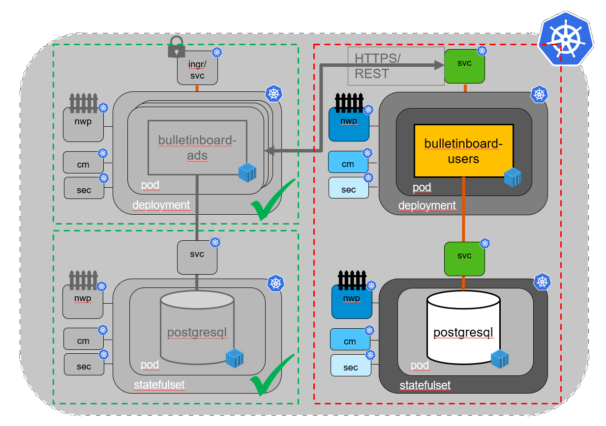
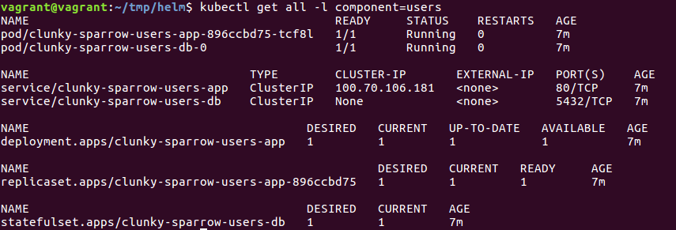

# - 2. PILOT in CW46 - !

# Exercise: Users Service with Helm

## Scope
The User Service (Application) will be installed with a provided helm chart. You only have to edit/insert a few values and work on the post-install-job which we will use to intialize the DB with some data. 
After the Service is running we will adapt our Ads deployment to provide the user route and enable the checking of the user service. 



### Overall purpose:

Get experience with a bit more complex helm chart compared to the helm exercise. Also it gives us an easy way to setup the user service without you having to write all the yamls again. 

## The helm chart

We provide an almost complete helm chart for the User Service: [bulletinboard-users.tar.gz](bulletinboard-users.tar.gz)  
In it we make use of 2 images: First, like for ads, a postgres docker image to persist data. And second the user service image described in detail below.  
The structure of the K8s entities in this chart is similar to the ones you created for ads. Just that all yaml for one module are put into a single template file. There is `templates/users-db.yaml` for the database and `templates/users-app.yaml` for the user service itself. Finally there is also a network policies template to control who can access what and a yaml for a post-install-job (more on this in step 2). 

## User Service Docker image

We created a Docker image with Tomcat and "user.war" which is used in the helm chart: `cc-k8s-course.docker.repositories.sap.ondemand.com/k8s/bulletinboard-users:v0.4`. 
The version of the user service used here only needs a postgresql db to store the user data and has no other dependencies.
The following endpoints are given: 
- `/`: gives a 'Users: OK' string and 200 code.
- `/api/v1.0/users`: takes GET/POST to read or post user data
- `/api/v1.0/users/{id}`: GET/PUT/DELETE to read,change or delete a certian user. 

UserData is e.g.: `{"id" : "42", "premiumUser" : true, "email" : "john.doe@sample.org" }`, here permiumUser determines if the user can post ads or not. This is the attribute tested in the Ads-service.  
The Tomcat itself runs on `port: 8080` and the user service is exposed under `/bulletinboard-users-service/`.  
We also use the cloud-foundary based way to pass to the user service the info about how to connect to the DB, namely we set an environment veriable `VCAP_SERVICES` with the right information. In ads we used an application.yml file to do this.

## Step 0: prerequisites
If you did not do the helm exercise, install the tiller service to enable helm in your namespace: `helm init --tiller-namespace <your-namespace>`. Also set an environmentVariable `TILLER_NAMESPACE` with the value of your namespace, our you have to add `--tiller-namespace <your-namespace>` to all helm commands below.  
Go to your project base folder `k8s-bulletinboard`, which you created at the beginning of exercise 1, and create a sub-folder `users`.
Download the chart into that subfolder and extract it: 
```bash
cd users
wget https://github.wdf.sap.corp/201810-ttt-wdf-docker-k8s-training/docker-k8s-training/raw/k8s-bulletinboard/kubernetes/k8s-bulletinboard/bulletinboard-users.tar.gz
tar -xvzf bulletinboard-users.tar.gz
cd bulletinboard-users
```

## Step 1: helm

__Purpose: Get familar with the provided template files and the user service.__

**Hint:** Remember setting the TILLER_NAMESPACE 

Before you can install the helm chart, open the *values.yaml* file. We left out the values of a few entries, you have to fill them out yourself:
- The values for e.g. Image and Version are mentioned above.
- For the password you can choose any string, if you want to generate one, you can do so by executing in an termial e.g. `openssl rand -base64 9` ([here are a few more ways](https://www.howtogeek.com/howto/30184/10-ways-to-generate-a-random-password-from-the-command-line/)). 
- ServicePort can be any port (e.g. 80 or 8080), you will need this one later to configure the route used by ads.
- TomcatPort should be 8080 (default port of the tomcat docker image).

Now do `helm install bulletinboard-users` in the `k8s-bulletinboard` folder containing the `bulletinboard-users` subfolder. In the current state the user-service will run, but there will be no data in the database. 
You can test that the user-service is runing by doing: 
- `kubectl get all -l "component=users"`, the pods should be on state running. <details><summary> Here you can see a example output.</summary><p></p></details>
- `kubectl port-forward <name-of-user-app-pod> 8081:8080`: this terminal is blocked by the open connection to the pod, either put it in the background (`crtl + z` + `bg`) or open a second terminal (`crtl + shift + t`)
- get users: `curl localhost:8081/bulletinboard-users-service/api/v1.0/users`
- post a user: `curl -i -X POST localhost:8081/bulletinboard-users-service/api/v1.0/users -H "Content-Type: text/json" --data '{"id" : "42", "premiumUser" : true, "email" : "john.doe@sample.org"}'`

If you do a "get-curl" request again you should now get the user back. It should look something like this: 
```vagrant@vagrant:~$ curl localhost:8081/bulletinboard-users-service/api/v1.0/users
[{"createdAt":1536141529412,"updatedAt":null,"version":1,"id":"42","email":"john.doe@sample.org","premiumUser":true}]
``` 
With this you have a running users service and now know a way to fill the DB with users.

## Step 2: Job to fill DB
In step 1 you added a premiumUser to the DB by hand, which we'll automate in this exercise.

__Purpose: Learn how to use a *job* and a bit more about *strings* in yamls__

In the bulletinboard-users/templates subfolder there is a `post-install-job.yaml`, this is almost complete, only the command to fill the DB is missing. Currently there is an `echo "hello k8s trainee"` executed where we want the command to put a user in the DB. Change this echo to the __"POST" curl__ you did by hand in step 1.  
Of course the address of the curl for this job is **not** `localhost:8081`. The pod in the job should send the request to the service pointing to the users app. 
Also think about how to handle the single and double quotes in the data part of the curl. You can read about [strings in yaml](http://blogs.perl.org/users/tinita/2018/03/strings-in-yaml---to-quote-or-not-to-quote.html) here. (Tip: In a yaml, if you want to use a ' in a single quoted string use ''.)  
After you adapted the file you can activated the job in the chart by setting the value `InitPostJobEnabled: true` (in `values.yaml`).  
Now delete the old helm chart. Use `helm list` to get the name of the installed chart and then do `helm delete <name of installed bulletinboard>`. Be aware that the persisted volume claim created during install does not get deleted by this. You can removed it yourself. 

After it is gone you can execute again `helm install bulletinboard-users`. 
Now there should also be a job with a corresponding pod, which runs once and stops after it is done. 
You can check this with `kubectl get jobs` and `kubectl logs <name of job pod>` to see what the job did.
Again you can check the user service with:
- `kubectl port-forward <name-of-user-app-pod> 8081:8080`
- get users: `curl localhost:8081/bulletinboard-users-service/api/v1.0/users`, now you should get the user which our job put in. 

There is one line commented out in the `post-install-job.yaml` file: `#    "helm.sh/hook-delete-policy": hook-succeeded`. If you comment it in, the job will be deleted after it run successfully. Helps keep your namespace clean, yet you can't review the logs of the successful job. 

## Step 3: Adapt Ads

__Purpose: show communication between apps through a service; finsish bulletinboard__

Up till now your Ads was not asking a User Service for information on a certain user. The ads app we use has a flag with which we can turn this on. To work the app needs 2 more environment variables: 
- `POST_USER_CHECK = true`: turns the checking of users on.
- `USER_ROUTE = <route to users>`: contains the route to the user service app, without the api/v1.0/users ending. It starts with `http://`.  
  Adapt your configmap for the environment variables to also contain these values and also add them to the deployment with the right names. After `kubectl apply -f ads-app.yaml` to update the deployment on the cluster itself, the old pod should stop and a new one started.
- Also adjust your network policy for __ads:app__ to allow traffic to (egress) __users:app__. 

After this, please test that you now need a header `User-Id : 42` in your POSTS to `api/v1/ads` to be able to create a new advertisement, e.g. via postman or via `curl -k -X POST ...` . Also since we activated TLS in Exercise 3 , remember to send the requests to `https://` now. The UI itself already has this field in its requests to the ads-service therefore using it does not test this. 

## Troubleshooting tips

- If you encounter difficulties you can use `helm install --dry-run --debug bulletinboard-users` to check if the generated yamls.
- For some changes a `helm upgrade <release-name> bulletinboard-users` updates the chart to the new changes.
- For others, like labels, you need to delete the old installation before reinstalling the new one. `helm delete <release-name>`
- The release name are the first two words (adjective+animal) of the name of the users-db and users-app pods in `kubectl get pods`.
- For step 3, if you can't create a new ads. 
  - check if the new variables are known inside the pods: `kubectl exec -it <ads-app-...> bash` and do `export` to see what the environment variables are.
  - check kubectl logs <ads-app-...> on both pods
  - If in postman you get a 200 and all ads as a return to a POST, check if your URL starts with https://
