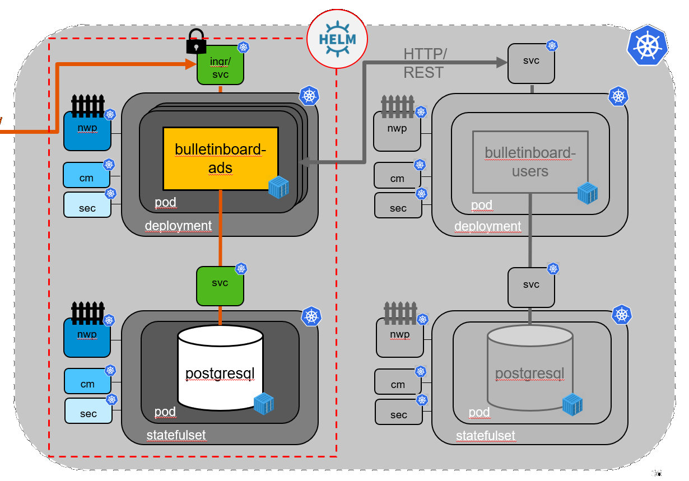

# - 2. PILOT in CW46 - !

# Optional - Exercise: "Create Helm chart for Bulletinboard-Ads App and -Database"

The following exercises are still a bit rough and not completly finished. But they should give you an idea on how writing a helmchart works and introduces a few more functions of helm. We do not expect you to finish them. But we highly appreciate [feadback](https://github.wdf.sap.corp/slvi/docker-k8s-training/issues) on them.

## On the current state of this exercise

Step 1 is fitted to the current state of the previous exercises while step 2 and 3 are for an earlier version and you need to adapt things to the current state. E.g. applications-k8s.yaml gets passed now as a secret while the text here (Step2) assumes it is still in a configmap. Take the same route as in step 1 with initdb.sql here.  

## Scope
Create a helm chart for ads (app and db)

## Step 1: [Author the chart to include the Ads DB](exercise_05_ads_helm_chart_1_Database.md)

## Step 2: [Author the chart to include the Ads App](exercise_05_ads_helm_chart_2_Application.md)

## Step 3: [Author the chart to include dependency to the Users Chart](exercise_05_ads_helm_chart_3_Advanced.md)

