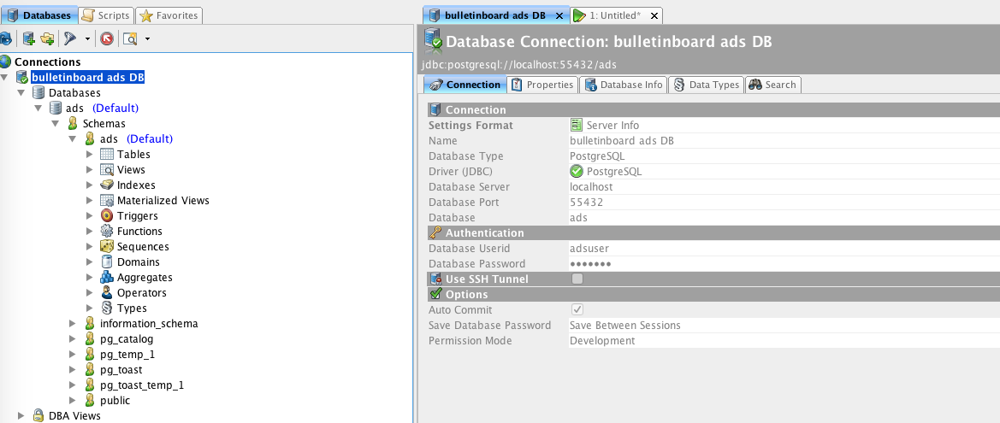

Exercise 5.1: Creating a chart to include the Database required by the ads application
====================================================

## Learning Goal
Create a new helm chart with all DB related Kubernetes objects with the help of a Helm chart

## Helm components we will use

- use of `_helpers.yaml` to define templates/functions for certain parts of our chart.
- `include "name" .` instead of `template "name" .` [See here](https://github.com/helm/helm/blob/master/docs/chart_template_guide/named_templates.md#the-include-function)
- Pipe function `indent X` to set the indent of certain elements
- `.Files.Get` to read in a file
- Pipe function `replace` to replace one part of a string with an other part.
- Pipe function `b64enc` to encode strings for values of secret items.
- Check the use of the right `{{-`,`{{`,`}}`,and`-}}` to fix linebreaks and empty lines in the generated yamls. 

## Prerequisite

To get things started, create a default chart with helm authoring tools:

```commandline
$ helm create bulletinboard-ads                                                    
Creating bulletinboard-ads
```
The new chart is stored in a directory named `bulletinboard-ads`. Inspect the structure created by Helm.
```
bulletinboard-ads
  Chart.yaml         
  charts/
  templates/ 
  values.yaml         
``` 
- remove contents in the file `templates/NOTES.txt`
- remove contents in the file `values.yaml`
- remove from templates folder the autogenerated files deployment.yaml, service.yaml and ingress.yaml
> **Tip**: Don't delete them, you can use them as an example for the next steps. Just move them out of the chart folder structure.
- To `Chart.yaml` Add some more fields, like sources or maintainers. See https://github.com/helm/helm/blob/master/docs/charts.md#the-chartyaml-file

> **IMPORTANT**: Please do `export TILLER_NAMESPACE=<your namespace>` so you do not always have to add `--tiller-namespace <your namespace>` to all helm calls. 

## Step 1: Getting the templates

Copy all kubernetes files `ads-db-*.yaml` you created for ads-db into the templates folder. 

Now the contents of the `templates` directory should look like this:
```
templates
  ads-db-configmap.yaml      
  ads-db-networkpolicy.yaml  
  ads-db-secrets.yaml         
  ads-db-service.yaml
  ads-db.yaml
``` 

## Step 2: First Install

We will see what the helm chart looks like now! Execute the following in bulletinboard-ads folder and Inspect installation.
```bash
$ helm install .
```

<details><summary>An example printout:</summary><p>
  
```bash
$ helm list
NAME           	REVISION	UPDATED                 	STATUS  	CHART                  	NAMESPACE         
<release_name>	2       	Fri Aug  3 10:07:42 2018	DEPLOYED	bulletinboard-ads-0.1.0	<your_namespace>

$ kubectl get po,svc,deployment,statefulset,job,pv,pvc,configmap,networkpolicy,secret
NAME                                READY     STATUS    RESTARTS   AGE
pod/ads-db-0                        0/1       Pending   0          6s

NAME                      TYPE        CLUSTER-IP      EXTERNAL-IP   PORT(S)     AGE
service/ads-db-headless   ClusterIP   None            <none>        5432/TCP    6s

NAME                      DESIRED   CURRENT   AGE
statefulset.apps/ads-db   1         1         6s

NAME                                                        CAPACITY   ACCESS MODES   RECLAIM POLICY   STATUS    CLAIM                                                           STORAGECLASS   REASON    AGE
persistentvolume/pvc-b818fa26-96f9-11e8-a881-528f19d9068b   2G         RWO            Delete           Bound     bulletinboard-helm/ads-db-volume-ads-db-0                       default                  3s

NAME                                                               STATUS    VOLUME                                     CAPACITY   ACCESS MODES   STORAGECLASS   AGE
persistentvolumeclaim/ads-db-volume-ads-db-0                       Bound     pvc-b818fa26-96f9-11e8-a881-528f19d9068b   2G         RWO            default        6s

NAME                           DATA      AGE
configmap/ads-db-config        1         6s

NAME                                     POD-SELECTOR              AGE
networkpolicy.extensions/ads-db-access   component=ads,module=db   6s

NAME                         TYPE                                  DATA      AGE
secret/ads-db-secrets        Opaque                                1         6s

```
</p></details>

What do you notice? Does everything looks like before, when you created all Kubernetes objects individually?

Now uninstall the chart

```bash
$ helm delete <release_name> 
```

What do you notice?

Everything is removed at once or is there still something there? Why? Also try `--prune` option for delete.

## Step 3: Parameterize the DB kubernetes manifest files

> **IMPORTANT: Uninstall chart first**
You need to do this because trying to update the chart will not work due to all the changes we will make to the files.

We will now start to parameterize the  yamls.
**Hint:** To test if what we do has the desired effect we should use `helm install --dry-run --debug .` and/or `helm lint`. 

### Step 3.1: Values and Helpers 

- Add the following values to `values.yaml`:

```yaml
Db:
  ConfigName: ads-db-configmap
  SecretName: ads-db-secret
  ServiceName: ads-db-service
  StatefulsetName: ads-db-statefulset
  AccessName: ads-db-access
  Component: ads
  Module: db
```

- Remove all default content from `_helpers.tpl` and add 3 template/functions: 
  1. Template for Component and Module tag + release name to distinguish different installs, can be used for MatchSelectors and labels
  2. Template for metaclass labels section
  3. Function that produces fully qualified names for all kubernetes objects used for metaclass name key. All Entities get the release name added to their name.
 
<details><summary> Here is the code for the 3 template/functions</summary><p>
  
```
{{/*
Complete tages for labels selectors etc.
*/}}
{{- define "tags.ads.db" }}
component: ads
module: db
release: {{ .Release.Name }}
{{- end -}}

{{/*
Complete metaclass labels entry
*/}}
{{- define "labels.ads.db" }}
  labels:
    heritage: {{ .Release.Service | quote }}
    chart: "{{ .Chart.Name }}-{{ .Chart.Version }}"
{{- include "tags.ads.db" . | indent 4 }}    
{{- end -}}

{{/*
Ads release name prefix to string and truncates to 63 chars.
Used for Names of Chart entities
*/}}
{{- define "add-release-name" -}}
{{- $name := index . "name" -}}
{{- $dot := index . "dot" -}}
{{- printf "%s-%s" $dot.Release.Name $name | trunc 63 | trimSuffix "-" -}}
{{- end -}}
```    
</p></details>


### Step 3.2: Metadata Names

- We use these templates now to first change names in all kubernetes manifest files:

|File         | Name      | 
| ------------- |-----------| 
| `ads-db-configmap.yaml`| `metadata:  `<br/>` name: {{ template "add-release-name" (dict "dot" . "name" .Values.Db.ConfigName) }}`|
| `ads-db-secret.yaml`| `metadata:  `<br/>`  name: {{ template "add-release-name" (dict "dot" . "name" .Values.Db.SecretName) }}`|
| `ads-db-service.yaml`| `metadata:  `<br/>`  name: {{ template "add-release-name" (dict "dot" . "name" .Values.Db.ServiceName) }}`|
| `ads-db-statefulset.yaml`| `metadata:  `<br/>`  name: {{ template "add-release-name" (dict "dot" . "name" .Values.Db.StatefulsetName) }}`|
| `ads-db-networkpolicy.yaml`| `metadata:  `<br/>`  {{ template "add-release-name" (dict "dot" . "name" .Values.Db.Access) }}`|

Here some explanation on the template: Normally you can give to template the name of the template and the scope. We use a dictionary (dict) to pass more arguments to the template so its more like a function. The frist entry of the dict is the root context ` . ` saved as `dot`. The second is the name to which we want to add the releasename. Of course you could add even more entries into the dictonary to pass more arguments to the template. 

- Also Updated references in `ads-db-statefulset.yaml'

```yaml
[...]
spec:
  serviceName: {{ template "add-release-name" (dict "dot" . "name" .Values.Db.ServiceName) }}
[...]
      - name: init
        secret:
          secretName: {{ template "add-release-name" (dict "dot" . "name" .Values.Db.SecretName) }}
[...]
            configMapKeyRef:
              name: {{ template "add-release-name" (dict "dot" . "name" .Values.Db.ConfigName) }}
[...]
            secretKeyRef:
              name: {{ template "add-release-name" (dict "dot" . "name" .Values.Db.SecretName) }}
[...]
```

Now do `helm install --debug --dry-run .` in the bulletinboard-ads folder and inspect if the names are changed as you thought and also the references still link correctly.

### Step 3.3. Labels and their references

- Change all metadata labels to something like the following, but make use of the "labels.ads.db" template: 

```yaml
metadata:
  labels:
    heritage: {{ .Release.Service | quote }}
    chart: "{{ .Chart.Name }}-{{ .Chart.Version }}"
    release: {{ .Release.Name | quote }}    
    component: "{{ .Values.Db.Component }}"
    module: "{{ .Values.Db.Module }}"

```

- Replace all match labels and selectors:
  We add the `release` tag as selector/matchlabel component (next to `component`/`module`) to distinquish different installations. As with the metaclass labels we use the template we defined in `_helpers.yaml`. Check for the right indent.

```yaml
    matchLabels:
{{- include "tags.ads.db" . | indent 6 }}

  selector:
{{- include "tags.ads.db" . | indent 4 }}
```

>  **Warning**: Do not change the ` ingress / from/ podSelector / matchLabels` 
in `ads-db-networkpolicy.yaml` as this is defining the labels for accessing the database service (for the application later)


Now again do `helm install --debug --dry-run .` in the bulletinboard-ads folder and inspect if the labels are changed as you thought and also the selectory still link correctly.

## Step 4: Parameterize PostgreSQL

- Add the following values in `values.yaml` to the Db section

**Hint: Please substitute the place holders below <...> by proper values !**

```yaml
Db:
  Postgres:
    Image: postgres
    ImageTag: 9.6
    MountPath: /var/lib/postgres/data
    RootPassword: <value of postgres_password_value>
    Database: ads
    Schema: ads
    User: adsuser
    Password: <value of the adsuser password>
    Port: 5432
```

- Update Mount path in `ads-db-configmap.yaml`
```yaml
data:
  pgdata_value: "{{ .Values.Db.Postgres.MountPath }}/pgdata"
```
### Step 4.1 The Secrets

- Create a `initdb.txt` file in `bulletinboard-ads` folder with the following content. When helm reads it in, it will substitute all the placeholders with the values we specified in  the `values.yaml`

```
-- This is a postgres initialization script for the postgres container. 
-- Will be executed during container initialization ($> psql postgres -f initdb.sql)
CREATE ROLE {{ .Values.Db.Postgres.Username }} WITH LOGIN PASSWORD '{{ .Values.Db.Postgres.UserPassword }}' INHERIT CREATEDB;
CREATE DATABASE {{ .Values.Db.Postgres.Database }} WITH ENCODING 'UNICODE' LC_COLLATE 'C' LC_CTYPE 'C' TEMPLATE template0;
GRANT ALL PRIVILEGES ON DATABASE {{ .Values.Db.Postgres.Database }} TO {{ .Values.Db.Postgres.Username }};
CREATE SCHEMA {{ .Values.Db.Postgres.Schema }} AUTHORIZATION {{ .Values.Db.Postgres.Username }};
-- ALTER DATABASE {{ .Values.Db.Postgres.Database }} SET search_path TO '{{ .Values.Db.Postgres.Schema }}';
ALTER DATABASE {{ .Values.Db.Postgres.Database }} OWNER TO {{ .Values.Db.Postgres.Username }};
```

- Add the following code to the `_helpers.yaml` file. The `tpl` function takes a text and applies all templates on it before passing it along. The `b64enc` is used to then encoded it for the secret.  
```
{{/*
template for initdb sql secret
*/}}
{{- define "initdb.encoded" -}}
{{- tpl (.Files.Get "initdb.txt") . | b64enc}}
{{- end -}}
```

- Update database admin password `ads-db-secret.yaml`, use `b64enc` to encode the password. 
```yaml
data:
  postgres_password_value: {{ .Values.Db.Postgres.RootPassword | b64enc }}
  initdb_sql_value: {{- template "initdb.encoded" . }}
```

- Update port for the service in `ads-db-service.yaml`
```yaml
spec:
  ports:
  - port: {{ .Values.Db.Postgres.Port }}
```

- Update stateful set specification in `ads-db.yaml`
```yaml
    spec:
      containers:
        image: "{{ .Values.Db.Postgres.Image }}:{{ .Values.Db.Postgres.ImageTag }}"
        ports:
        - containerPort: {{ .Values.Db.Postgres.Port }}
          name: ads-db-port
        volumeMounts:
        - name: ads-db-volume
          mountPath: {{ .Values.Db.Postgres.MountPath }}
        - name: init
          mountPath: /docker-entrypoint-initdb.d/
        env:
        - name: PGDATA
          valueFrom:
            configMapKeyRef:
              name: {{ template "add-release-name" (dict "dot" . "name" .Values.Db.ConfigName) }}
              key: pgdata_value
        - name: POSTGRES_PASSWORD
          valueFrom:
            secretKeyRef:
              name: {{ template "add-release-name" (dict "dot" . "name" .Values.Db.SecretName) }}
              key: postgres_password_value
          
          
```

## Step 5: Install the Chart and test the Microservice

- First after checking with `helm install --debug --dry-run .` that all yamls are generated correctly do

```bash
$ helm install bulletinboard-ads 
```


<details>
<summary>Inspect installation with helm list:</summary>
<p>

```bash
$ helm list
NAME           	REVISION	UPDATED                 	STATUS  	CHART                  	NAMESPACE         
<release_name>	2       	Fri Aug  3 10:07:42 2018	DEPLOYED	bulletinboard-ads-0.1.0	<your_namespace>

$ kubectl get po,svc,deployment,statefulset,job,pv,pvc,configmap,networkpolicy,secret
NAME                                READY     STATUS    RESTARTS   AGE
pod/<release_name>-ads-db-sset-0   1/1       Running   0          30s

NAME                                     TYPE        CLUSTER-IP      EXTERNAL-IP   PORT(S)     AGE
service/<release_name>-ads-db-service   ClusterIP   None            <none>        5432/TCP    23m
service/tiller-deploy                    ClusterIP   100.65.132.84   <none>        44134/TCP   30m

NAME                                           DESIRED   CURRENT   AGE
statefulset.apps/<release_name>-ads-db-sset   1         1         23m

NAME                                                        CAPACITY   ACCESS MODES   RECLAIM POLICY   STATUS    CLAIM                                                            STORAGECLASS   REASON    AGE
persistentvolume/pvc-264615f2-96f1-11e8-a881-528f19d9068b   2G         RWO            Delete           Bound     <your_namespace>/ads-db-volume-<release_name>-ads-db-sset-0   default                  23m

NAME                                                                STATUS    VOLUME                                     CAPACITY   ACCESS MODES   STORAGECLASS   AGE
persistentvolumeclaim/ads-db-volume-<release_name>-ads-db-sset-0   Bound     pvc-264615f2-96f1-11e8-a881-528f19d9068b   2G         RWO            default        23m

NAME                                      DATA      AGE
configmap/<release_name>-ads-db-config   1         23m
configmap/<release_name>-ads-db-init     1         23m

NAME                                                     POD-SELECTOR                                                                  AGE
networkpolicy.extensions/<release_name>-ads-db-access   component=<release_name>-bulletinboard-ads,module=<release_name>-database   23m

NAME                                 TYPE                                  DATA      AGE
secret/<release_name>-ads-db-cred   Opaque                                1         23m
```

</p>
</details>

Now test the Db using the same tests as during the previous exercises. 
  1. Exec onto the pod and use pgadmin to test.
  2. `kubectl port-forward <pod_name>  5432:5432` and use a local DB viewer.



