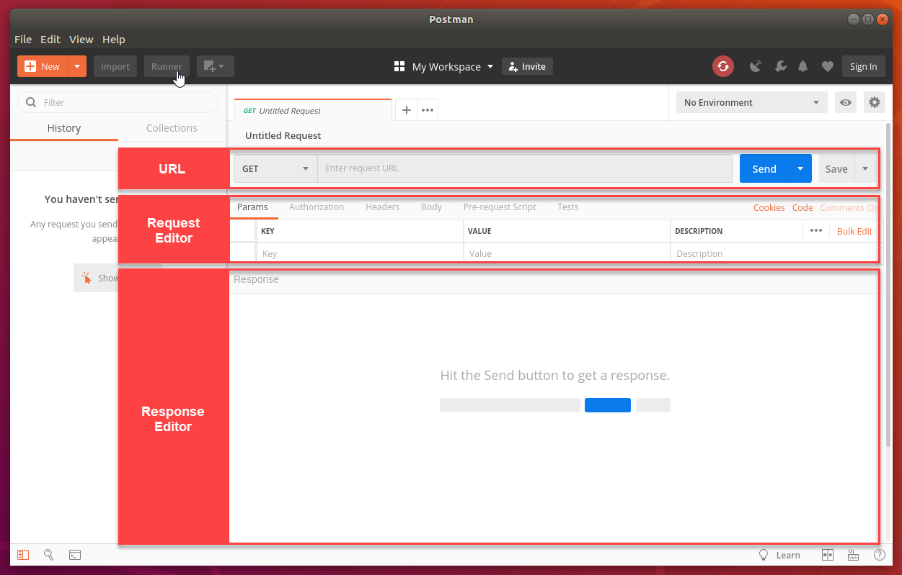
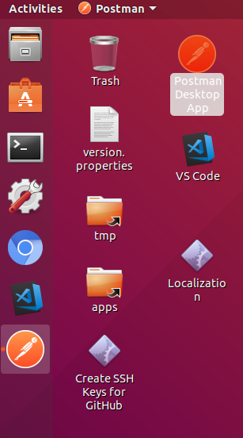

# Call Bulletinboard-Ads App With Postman (REST Client)

Postman is a Google Chrome app for interacting with HTTP APIs. It has a friendly GUI for constructing requests and reading responses.



## Step 1: Open Postman
- On Desktop click on the `Postman Desktop App` to open the app. It can take a few seconds to start.  
  

- Select `GET`  in the URL section and paste the URL to the `/health` endpoint of your **Bulletinboard-Ads** App. (**Hint**: You must use the HTTP protocol).
- Send the request. As response `{"status":"UP"}` should be returned.

## Step 2: Get All Advertisements
- In Postman, extend the URL of your app with `/ads/api/v1/ads/` to `http://bulletinboard--<your-name-space>.ingress.<your-trainings-cluster>.k8s-train.shoot.canary.k8s-hana.ondemand.com/ads/api/v1/ads`.

- Send the request. As response an empty array should be returned. **Remark**: We do not have created any advertisements so far - so there are no ones

## Step 3: Create New Advertisement
- In Postman, select `POST` instead of `GET` as request method
- On tab `Body`
  - Select the radio button `raw`
  - Instead of `Text` select `JSON (application/json)` from the drop down list
    
  - Enter below JSON in the text field
    - **Hint:** Replace `<place-holder>` accordingly
```
{
	"title":"new-advertisement-from-<your-user-id>-1",
	"price": "140",
	"contact": "test@sepp.com",
	"currency" : "EUR"
}
```
- Send the request, it should succeed.
  - As response you should get the created advertisement
    
- Create another advertisement with a different title, e.g. `"new-advertisement-from-<your-userid>-2`"

## Step 4: Get All Advertisements
- In Postman, switch back to `GET` as request method
- Send the request and check whether your advertisements are returned
