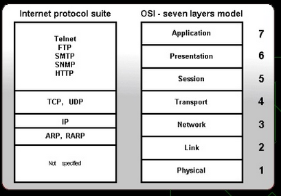
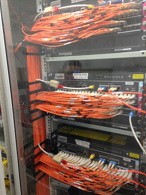

# Basic Network Knowhow

## OSI network stack model
* Computer networks are generally described in layers.
* On the bottom you have the physical / electrical layer (what wire, what voltage, what plugs, …), on the top you have application level exchange protocols (e.g. command patterns, document exchange formats etc)
* Higher protocols are based on lower ones; each layer wraps lower layer content in its own headers / frames. 
* The [OSI Stack model](https://en.wikipedia.org/wiki/OSI_model) is pretty much the standard for networking. Levels 1 - 4 are well standardized and will be described briefly below.
* Protocols 'run' on a layer. For example, TCP/IP is a layer 3/4 protocol. Http runs on layer 7.

## MAC Addressing (OSI Layer 2)
* Every network card has a unique MAC address (globally unique in the world). They look like this: `34-02-86-5F-80-2B`
* A computer can have multiple network cards, i.e. thereby access multiple networks and will then have different addresses in the different networks.
* MAC addressing is used on the OSI layer 2 (link). When a computer knows the MAC address of the target machine they communicate directly. 
* Tools: You can see the network address(es) and all other network information of your computer with this command:
  - Windows: `ipconfig /all` - then look at the field 'physical address'
  - Mac: TODO
  
## Network segments / subnets and switches (layer 2) and routers
* Large networks are segmented into sub-networks. These can be small, e.g. 10-20 computers, or larger. At SAP a LAN subnet typically has 1000 addresses.
* At SAP every room has a 'network switch' that devices such as a computer can connect to by wire. A switch knows to direct the traffic to the right endpoint / device according to target address. **Switches address devices by MAC addresses**. 
* Strictly speaking, a standard `switch` only knows devices by their MAC addresses. The translation of IP address to MAC address of a target is transparent to the switch and typically the job of a `router`. 
* Every network switch (e.g. in a room) is directly connected to a router (usually by a fiber optic cable). The picture show a switch at SAP in Walldorf that connects the rooms from one floor in WDF18.

* When source and target address is in the same sub-network the devices communicate directly via the subnet switch
* Most switches used in offices in big companies are also routers but mostly operate only as switches (MAC addressing in the same subnet). 
* Default gateway: When communication does not go directly go to one of the other known devices on the subnet, it is sent to the **default gateway** which is the router at the border of a subnet that routes the traffic towards its destination.

## Routers
* A router connects two or more subnets. It routes all traffic that goes into or out from a subnet to other subnets or ultimately 'the internet'. 
* While devices are connected logically directly to a switch, a router routes / sends data packets 'closer to their destination', possibly to another switch or the next router. Routers know enough of the network topology (centrally administered) so that they can send IP packets on the right next (sub-) network closer towards their destination.
* Many switches are also routers (have router features)

## IP addresses, DHCP
* IP addressing happens on layer 3. IP addresses look like this (IPv4): `134.45.102.211`
* While MAC addresses are fixed by the network card, IP addresses are *configured* (fixed) or assigned to computers and then used to identify source and target of a communication. 
* With the TCP/IP protocol computers can address each other via IP addresses
* Several IP addresses are fixed in each subnet and reserved for special purposes. See [Reserved IP Addresses](https://en.wikipedia.org/wiki/Reserved_IP_addresses)
* Dynamic assignment of IP addresses to devices is done via a DHCP (=dynamic host configuration protocol) server at the time when the device (e.g. computer) enters the network (plug in the cable, connect to WLAN).
* Computers on the internet are also addressed with IP addresses. These are pretty static / fixed and can be looked up by a global internet DNS (see below). 
* The address space of an intranet is kept independent of the internet by a proxy (see below) that does address translation. This way you can use IP addresses inside your intranet that also exist outside in the internet. 
* IPv4 versus IPv6: Since the standard IP addresses (IPv4) can only distinguish 2^32 addresses (32 bit = 4 bytes, roughly 4.2 billion) and the IP address space was getting used up in the internet, a new 128 bit address standard IPv6 (8 bytes) was defined. Many devices still support only IPv4 at this time. 
* Tools: TODO

## Domain addressing, DNS
* But we do not want to address computers by IP numbers either but instead by a 'name', i.e. the so-called **domain-addresses**, e.g. `portal.wdf.sap.corp`, `dwdf212` (short for `dwdf212.wdf.sap.corp`), `cfapps.sap.hana.ondemand.com` etc.
* A **DNS** (domain name system) server maps a registered logical name (server, computer, device) to the currently assigned IP address for that name. 
* When you use a DNS name (e.g. in the browser), the network interface first asks the configured DNS server (typically in the same building or institution) for the IP address of that name and then sends the real request using that IP address (the operating system caches this mapping to avoid too much DNS traffic). 
* When a DNS server cannot resolve a logical name to an IP address, it sends the name resolution request to the next 'more global' DNS server but the client device does not know what DNS server that is.
* The `DNS servers` shown in your network configuration (usually 2, see them in windows by `ipconfig /all`) are alternate servers. When the first server does not respond within a few seconds, the client (e.g. the windows TCP/IP network interface) will ask the second one. 
* The **DNS Suffix Search List** contains a list of suffixes that is appended to simple names 'without dots' when they are not found in the DNS. For example, when you enter just 'portal' in the browser address field, the DNS will automatically append ".wdf.sap.corp" which is then found and used. 

## Proxies 
* Every request that goes outside of the SAP intranet to the internet goes through a proxy. A proxy typically provides multiple functions such as caching, blocking/filtering, reporting, and network address translation (NAT).
* A device that performs NAT (such as our proxy) forwards the request to the real target (outside IP address) and hides the internal requesting computer's IP address by inserting its own IP address as the 'from' address in the request. This way all computers behind a proxy appear as having the same source IP address. 
* In order to be able to send a request outside of the SAP intranet, each client (e.g. browser) has to set a proxy address. All requests that go outside of the office network zone must go through the proxy server. Http(s) requests are forwarded through the proxy, most other protocols and ports are blocked. 
* Each SAP location that has its own local independent internet connection has its own proxy, e.g. `proxy.wdf.sap.corp`, `proxy.shg.sap.corp`, etc.
* These proxies are so-called [forward proxies](https://en.wikipedia.org/wiki/Proxy_server) because they forward requests from the intranet to the external internet. 
* There are also so-called [reverse-proxies](https://en.wikipedia.org/wiki/Reverse_proxy) whose main purpose is to distribute incoming requests from the internet to systems in the [DMZ](https://en.wikipedia.org/wiki/DMZ_(computing)) (see also below) and make the responses appear as coming from a single server.

* **Currently the proxy has to be explicitly set in the internet explorer / all browsers as well as in all tools (e.g. Eclipse) and runtimes (e.g. a Java process) that want to access the internet.** This can be done through parameter settings or command line options depending on the tool.    

