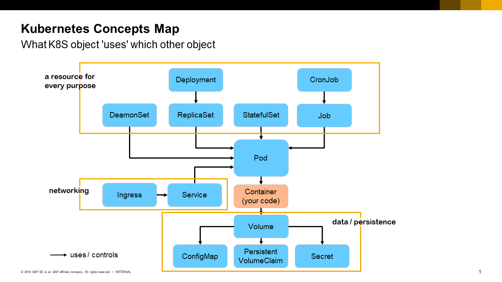

# Kubernetes High-Level Concept Overview

Here a diagram with the most important objects / concepts of Kubernetes and how they relate to each other. See below for a description of the elements.

## Key Concepts within a Cluster

Concept | Purpose | Defines / controls / has feature 
--------|---------|-------------------------------------
[Label](https://kubernetes.io/docs/concepts/overview/working-with-objects/labels/)  | Tag and select sets of K8S objects;  attached to all k8s resources/objects | Sets of name-value pairs used to define dependencies (e.g. who-uses-what) 
[Pod](https://kubernetes.io/docs/concepts/workloads/pods/pod-overview/) | Run co-located containers;  is smallest deployable unit | Defines: which **containers** (images) to run; provides ephemeral - or attaches persistent storage (**volumes**) to the containers;   containers in the same pod share network, common IP address, different ports, communicate via localhost;   optionally define liveness and readiness check endpoints; pods are ephemeral (can die) and run on **nodes**
[Container](https://kubernetes.io/docs/concepts/containers/container-environment-variables/) | Is an instance (running or stopped) of a lightweight and portable executable image that contains the software and all of its dependencies | Gets environment variables, network and persistence from **pod** 
[Node](https://kubernetes.io/docs/concepts/architecture/nodes/) | Run multiple pods;  provide system services to pods | Node is a VM that is part of the cluster 
[ReplicaSet](https://kubernetes.io/docs/concepts/workloads/controllers/replicaset/) | Ensure that a target number of pod instances is always running  | Uses **pod** template to define which container to use, specify fixed target number of instances or auto-scaling via Horizontal Pod Autoscaler. 
[Service](https://kubernetes.io/docs/concepts/services-networking/service/)   | Provide access to logical set of pods  | Defines: Logical set of **pods** (by label selectors), single stable IP address and DNS name to access them (only within the cluster i.e. between pods!)  
[Deployment](https://kubernetes.io/docs/concepts/workloads/controllers/deployment/)  | Provide declarative updates for Pods and ReplicaSets; run stateless pods and manage scaling and updates  | Defines: **ReplicaSet** (to define pods and # of replicas), provides controlled versioning, updates (zero-downtime, rolling, ...), rollback etc.
[Volume](https://kubernetes.io/docs/concepts/storage/volumes/) | Provides access to disk storage for pod | On-disk files in containers are ephemeral by default; pods can offer disk storage to containers (shared by all) that is ephemeral (gone when pod terminates) or persistent
[NameSpace](https://kubernetes.io/docs/concepts/overview/working-with-objects/namespaces/)   | Defines virtual cluster(s) as part of the one physical cluster | Can assign permissions and resource quotas to namespaces (e.g. parts of an application, or stages in a CD pipeline etc.)
[StatefulSet](https://kubernetes.io/docs/concepts/workloads/controllers/statefulset/) | Manage deploy and scaling of stateful pods  | Provides unique identity to its **pods** and guarantees on ordering of deployment and scaling
[Job](https://kubernetes.io/docs/concepts/workloads/controllers/jobs-run-to-completion/)   | Run pods as one-time jobs | Defines: **Pod** to run, number of pods, parallelism mode
[CronJob](https://kubernetes.io/docs/concepts/workloads/controllers/cron-jobs/)  | Run time-based jobs  |  Run **job**s at given times; one-time or repeatedly by time & date
[Ingress](https://kubernetes.io/docs/concepts/services-networking/ingress/)  | Provide external access to some services in the cluster    Ingress can provide load balancing, SSL termination and name-based virtual hosting|  Defines: **Service** to expose, DNS name to expose externally, offers load balancing and URL mapping (to multiple target services), SSL termination
[Secret](https://kubernetes.io/docs/concepts/configuration/secret/) | Provide sensitive information to pods | Sensitive information (e.g. credentials) should not be part of containers/pods but be injected from outside; secret can be file or key-value pair; are assigned to pods and can be read as file (via volume) or in ENV
[ConfigMap](https://kubernetes.io/docs/tasks/configure-pod-container/configmap/)   | Provide configuration to pod  | Provide as key-value pair of file; assign to pod; access via volume (file) or ENV 

   
   
