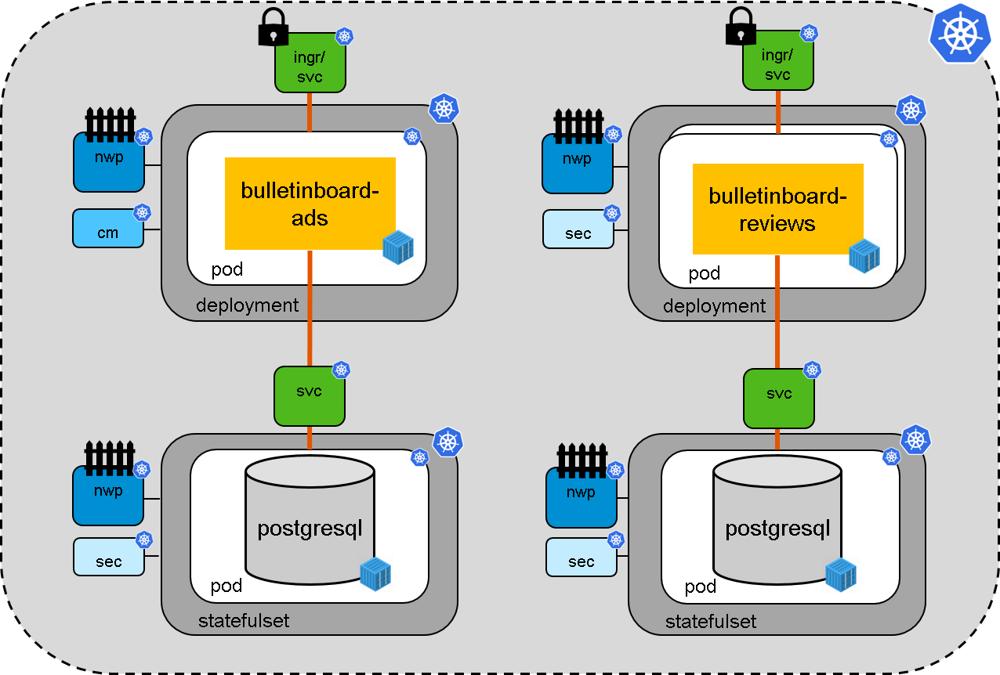

# Microservice-based Application in Kubernetes using Cloud Curriculum Sample Application "Bulletinboard"

In the following **5 exercises** you will learn how to deploy a microservice-based business application in a Kubernetes-cluster. 
As sample application we are using the **[Bulletinboard from the Cloud-Native-Boot-Camp](https://github.wdf.sap.corp/cloud-native-bootcamp/info)**. 

The Bulletinboard is build up by two individual microservices:
- **[Bulletinboard-Ads](https://github.wdf.sap.corp/cloud-native-bootcamp/bulletinboard-ads-java)** (Java), which can **list**, **create** and **delete advertisements**
- **[Bulletinboard-Reviews](https://github.wdf.sap.corp/cloud-native-bootcamp/bulletinboard-reviews-nodejs)** (NodeJs), which contains ratings for users.

The advertisements are presented differently depending of the rating of the user, who created the advertisement.
The overall structure of **Bulletinboard 'in K8s'**, incl. the different **K8s entities** needed for Kubernetes can be found in the following picture.



_Legend: `ingr`: Ingress, `svc`: Service, `nwp`: Network policy, `cm`: Configmap, `sec`: Secret_

## Exercises

### [01 Exercise: "Build and Push the Docker Images"](exercise_01_make_images_available.md)
- Build and push the docker images for bulletinboard-ads and bulletinboard-reviews.
- Create an **ImagePullSecret** for the training-registry.

### [02 Exercise: "Setup Bulletinboard-Ads Database"](exercise_02_ads_db.md)
- Database will run as a **Statefulset** secured with a password: Create a **Secret** for the password.
- Create a **Statefulset** for the Ads DB together with a headless **Service**.

### [03 Exercise: "Setup Bulletinboard-Ads Application"](exercise_03_ads_app.md)
- Create required **Configmap**
- Create **Deployment** for Ads App, using the **Configmap** and the **Secret** of the DB.
- Publish Ads App via **Service** and **Ingress**

### [04 Exercise: "Using Helm-chart to setup Bulletinboard-Reviews](exercise_04_reviews_as_helm_chart.md)
- Deploy Bulletinboard-Reviews via existing **Helm chart**

### [05 Exercise: "Networkpolicies & TLS for Bulletinboard-Ads"](exercise_05_ads_networkpolicies_and_certificate.md)
- Increase security and establish a **Network policy** for
  - Bulletinboard-Ads Database
  - Bulletinboard-Ads App
- Enable HTTPS connection by adding TLS certificates to **Ingress**

## Troubleshooting section

Since we are using the master branch, there is a slight chance that a new commit has broken the basic functionality. In case you run into any issues you can use a commit, which is tested, to build the docker images from:

#### Bulletinboard-Ads
```
git checkout ac5ddd541d6d7d8aa0ac645ab8e865e1eb483453
```

#### Bulletinboard-Reviews
```
git checkout 561848ef786cfe6ebad3dcb0144b040fe7239cb2
```

