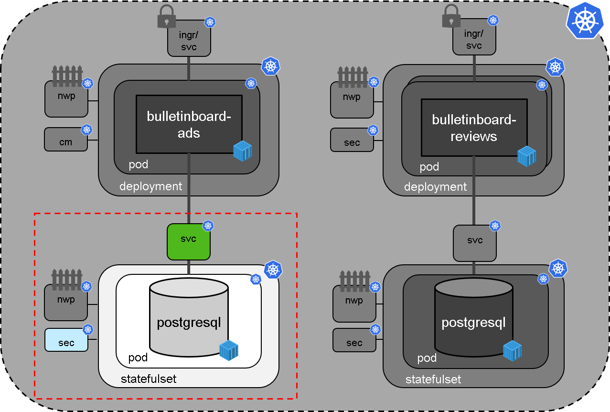
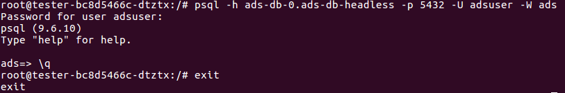

# Exercise 2 - Setup Bulletinboard-Ads Database

## Scope

- In this second exercise we will focus on the **setup of bulletinboard-ads database**, where the bulletinboard-ads microservice can store the advertisements (See picture below).



- Since a database needs to store data, we will use a **Statefulset** with only one instance (replica count=1).
- As database we will use Postgresql, where on DockerHub we can find a well suiting official [Postgresql Docker image](https://hub.docker.com/_/postgres/).
- The Postgresql Docker image gives us the possibility to override several default values via **environment variables** for e.g. the location for the database files (`PGDATA`) and the superuser password (`POSTGRES_PASSWORD`). (Information needed in step 3)
- In order to make the Bulletinboard-Ads Database **Pod** available we have to set up a **"headless" service** to allow the app to talk to the database.

## Labels

We make use of labels on **all** entities so they can be easier selected/searched for with kubectl. 

The structure for **Labels** (and hence for **Selectors** as well) has 2 levels.
On the first level we want to separate **Bulletinboard-Ads** from **Bulletinboard-Reviews**.
For this we introduce the **Label** `component` with value `ads` or `reviews`.
On the second level we separate the App-part from the Database-part within each "Component".
Here we introduce the **Label** `module` with value `app` or `db`. 

This hierarchy allows us to retrieve e.g all entities for our databases via a `kubectl get deploy,sts,pods,cm,secrets,svc -l module=db`, or for ads with `kubectl get deploy,sts,pods,cm,secrets,svc -l component=ads`.

## Step 0: Preparation

**Please, before you start with this exercises, clean up your namespace from what you did the previous days by deleting all deployments, statefulsets, pvcs, services etc.** This helps you by easier finding the entities in your namespace and us by reducing the load on the cluster!

- Create a folder `k8s-bulletinboard` in your home directory for the various yaml-files, you will create in the exercises.
- Create a sub-folder `ads` for all yaml-files, related to **Bulletinboard-Ads** (App/Microservice + DB).

## Step 1: Secret for Postgres Superuser Password

Purpose: Create a **Secret** with password for Postgres superuser
 
You can take any String as a master password.
If you want a random string you could do e.g. `openssl rand -base64 15`, which will already give you a random password (the `-base64` option is used to only have alphanumerics (almost) in the password).

- To create the yaml-file for the secret with the password use `kubectl create secret generic ads-db-secret --from-literal=<key>=<password> --dry-run -o yaml > ads-db-secret.yaml`.
- Now apply it to the cluster `kubectl apply -f ads-db-secret.yaml`

## Step 2: "Headless" Service

Purpose: Create the **"headless" Service**, required to access the pod, created by the statefulset.

- Specify a **"headless" Service** `ads-db-service` with proper labels and selector for [component and module](exercise_02_ads_db.md#labels). Use the default port, given by the Docker image (port 5432 as depicted by the description on [Docker Hub](https://hub.docker.com/_/postgres/)) and make sure you are using a named port (name it `ads-db-port`). Save the service under the filename `ads-db-service.yaml` in folder `k8s-bulletinboard/ads`.

- Now call `kubectl apply -f ads-db-service.yaml` to create the **"headless" Service**.

> [Hint](https://github.wdf.sap.corp/slvi/docker-k8s-training/blob/master/kubernetes/exercise_08_statefulset.md#step-0-create-a-headless-service)

## Step 3: Statefulset

Purpose: Create the **Statefulset**, which uses the Secret and the "headless" Service, created in step 1+2 (Creation of Statefulset will fail, if those entities are not yet available !).

_Hint: In the following sections we will provide you yaml-snippets of the Statefulset specification. Just substitute the place holders `<...>` by proper values !_

- Specify a **Statefulset** for the Postgres Database Pod with name `ads-db-statefulset` with proper labels and selector for [component and module](exercise_02_ads_db.md#labels). 

```yaml
---
apiVersion: apps/v1
kind: StatefulSet
metadata:
  name: <name-of-statefulset>
  labels:
    component: <name-of-component>
    module: <name-of-module>
```

- Refer to the "headless" service, created earlier and make sure that only one DB pod gets created. 

```yaml
spec:
  serviceName: <name-of-headless-service>
  replicas: <#-of-DB-pods>
  selector:
    matchLabels:
      component: <name-of-component>
      module: <name-of-module>
  template:
    metadata:
      labels:
        component: <name-of-component>
        module: <name-of-module>
    spec:
      containers:
      - name: ads-db-container
        image: postgres:9.6
        ports:
        - containerPort: 5432
          name: ads-db-port
        volumeMounts:
        - name: ads-db-volume
          mountPath: /var/lib/postgresql/data/
        env:
        - name: PGDATA
          value: "/var/lib/postgresql/data/pgdata"
        - name: POSTGRES_PASSWORD
          valueFrom:
            secretKeyRef:
              key: <key-in-the-secret>
              name: ads-db-secret
```

- For the creation of the PVC we are using the volumeClaimTemplates mechanism. Here just make sure you are using proper labels for [component and module](exercise_02_ads_db.md#labels). 

```yaml
  volumeClaimTemplates:
  - metadata:
      name: ads-db-volume
      labels:
        component: <name-of-component>
        module: <name-of-module>
    spec:
      accessModes: [ "ReadWriteOnce" ]
      resources:
        requests:
          storage: 1Gi
```

- When you are ready with the specification of the **Statefulset** save it under the filename `ads-db-statefulset.yaml` in folder `k8s-bulletinboard/ads` and call `kubectl apply -f ads-db-statefulset.yaml` to create the **Statefulset** `ads-db-statefulset`.

- After successful creation of the **Statefulset** check, whether the **Pod** `ads-db-statefulset-0` got created properly via `kubectl get pod ads-db-statefulset-0` or in more detail via `kubectl describe pod ads-db-statefulset-0` . Also check whether the Database is ready to be connected via `kubectl logs ads-db-statefulset-0`. There should be the line: `LOG:  database system is ready to accept connections` in the logs. 


## Optional- Step 3: Detailed Check whether Pod with Postgres DB is running properly

Purpose: check whether the database is running and accepting connections. Use either a temporary postgresql pod with sql or the [**pgadmin tool**](https://www.pgadmin.org/) for that.

Here are two different ways how you could test if the statefulset is configured correctly and the db initialized with the right user and password:

### Using a temporary postgres pod and psql

Create a temporary pod with psql installed (e.g. a postgres:9.6 image like our DB) and use psql from this pod to connect to the DB.

```bash
kubectl run tester -it --generator=run-pod/v1 --restart=Never --rm --image=postgres:9.6 --env="PGCONNECT_TIMEOUT=5" --command -- bash
```

A prompt with root@... should come up. You are now connected to the pod, here we can use psql to try to connect to our ads-db:
`psql -h ads-db-statefulset-0.ads-db-service -p 5432 -U postgres -W postgres`. After this you should connect to the postgres db, a prompt `postgres=>` will ask you for the next command. If this does, all is correctly set up!  
Type `\q` to quit psql since we only wanted to test that we can connect. Also exit the pod with the `exit` command. The pod should be removed after this automatically.

<p align="center"></p>

### Using port-forward and pgadmin in the VM

- Install **pgadmin** locally on your virtual machine. For the training virtual machine, use the following command to install the software: `sudo apt update && sudo apt install pgadmin3`

- Use `kubectl port-forward ads-db-statefulset-0 5432:5432` to forward the database port from the database pod of your statefulset to your local virtual machine. 

- With e.g. **pgadmin**, connect to the forwarded database port on your `localhost` and supply the credentials for the user that got created on the database by the initialization script. If the login succeeds, your database is up and running and this part of the exercise is complete.
