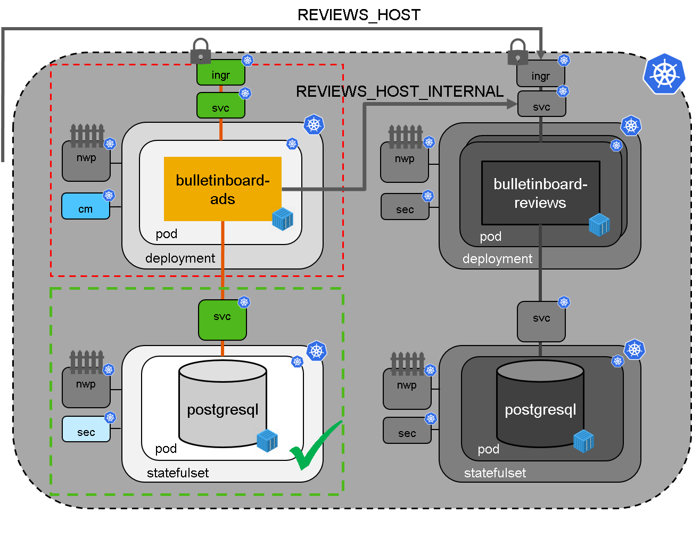

# Exercise: Setup Bulletinboard-Ads Microservice/ Application

## Scope

- In this third exercise we will focus on the **setup of bulletinboard-ads app** itself (Ads:App) and make it available within a K8s cluster via a **Service** and publish externally/ into the Internet via an **Ingress** (See picture below).



- Finally we will check **Ads App** running properly together with **Ads Database**.

- We decided our initial expected load to **Ads App** requires only 1 instance of our **Ads App**. Therefore we use a **Deployment** with 1 instances (replicas is 1).

- The **Bulletinboard-Ads**-App needs some environment variables set: `REVIEWS_HOST` containing a url to the **Bulletinboard-Reviews-App** and `SPRING_DATASOURCE_URL` containing the URI to the database along with `SPRING_DATASOURCE_PASSWORD` containing the password for the database.

- The structure for **Labels** (and with this for **Selectors**) has 2 levels as in exercise 2: To separate **Bulletinboard-Ads** from **Bulletinboard-Reviews** we introduce the **Label** `component` with value `ads` and `reviews`. To separate the App-part from the Database-part within each "Component" we introduce the **Label** `module` with value `app` and `db`.

## Step 1: ConfigMap

Purpose: Create a **ConfigMap** containing the values for the environment variables `REVIEWS_HOST` and `SPRING_DATASOURCE_URL`.

- Specify a **ConfigMap** for the **Bulletinboard-Ads** with name `ads-app-configmap`, with two key-value pairs and with proper labels for component and module.
- The **Bulletinboard-Reviews** is not yet deployed to the cluster, therefore we don't know the reviews-host-url yet, but let us assume we will make **Bulletinboard-Reviews** available under `https://bulletinboard-reviews-<your-participant-number>.ingress.<CLUSTER_NAME>.<PROJECT_NAME>.shoot.canary.k8s-hana.ondemand.com`.
- The datasource url given through the headless-service is `jdbc:postgresql://ads-db-statefulset-0.ads-db-service:5432/postgres`.
- Remember the keys you use for these values. You need them in yaml-file for the **Deployment** in the next step.
- Save your **ConfigMap** under the filename `ads-app-configmap.yaml` in folder `k8s-bulletinboard/ads`.

- Now apply the configmap to the cluster `kubectl apply -f ads-app-configmap.yaml`

> [Hint](/kubernetes/exercise_06_configmaps_secrets.md)

## Step 2: Deployment

Purpose:
Create the **Deployment**, which is dependent on the **Configmap** created in step 1 and the **Secret** containing the database password from the previous exercise.
The creation of **Deployment** will fail, if those are not yet available!
Also the **Secret** `training-registry` is needed to pull the image.

_Hint: In the following sections we will provide you several yaml-snippets of the deployment specification. Just substitute the place holders `<...>` by proper values !_

- Specify a **Deployment** for the **Bulletinboard Ads** with 2 instances, with name `ads-app-deployment` and with proper labels and selector for component and module. 

```yaml
---
apiVersion: apps/v1
kind: Deployment
metadata:
  name: ads-app-deployment
  labels:
    component: <name-of-component>
    module: <name-of-module>
spec:
  replicas: <#-of-instances>
  selector:
    matchLabels:
      component: <name-of-component>
      module: <name-of-module>
  template:
    metadata:
      labels:
        component: <name-of-component>
        module: <name-of-module>
    spec:
      imagePullSecrets:
      - name: <name-of-secret>
      containers:
      - name: ads
        image: <bulletinboard-ads-docker-image>
        ports:
        - containerPort: 8080
          name: ads-app-port
        env:
        - name: "???"
          value:
        - name: "???"
          value:
        - name: "???"
          value:
        - name: SPRING_DATASOURCE_USERNAME
          value: postgres
        resources:
          limits:
            memory: 1Gi
          requests:
            memory: 800Mi
```
- The missing environment variables in the snippet are `REVIEWS_HOST`, `SPRING_DATASOURCE_URL` and `SPRING_DATASOURCE_PASSWORD`.

- We also add a specific resource request for this app. The default memory-limit in each trainings namespace is 500Mi which is not enough for a spring boot application. We request 800Mi and allow an increase to 1G of Memory to be consumed by each pod. 

- When you are ready with the specification of the **Deployment** save it under the filename `ads-app-deployment.yaml` in folder `k8s-bulletinboard/ads` and call `kubectl apply -f ads-app-deployment.yaml` to create the **Deployment** `ads-app-deployment`.

- After successful creation of the **Deployment** check, wether a Pod got created properly via `kubectl get pods`.
The names of the pod should be something like `ads-app-deployment-xx-yx`.

## Step 3: Service & Ingress

Purpose: Make **Bulletinboard-Ads** available within your K8s Cluster via **Service** and "publish" externally into the Internet via a **Ingress**.

_Hint: In the following sections we will provide you yaml-snippets of the Service specification. Just substitute the place holders `<...>` by proper values !_

### Service

- Specify a **Service** for the **Bulletinboard Ads**, with name `ads-app-service`, a named targetPort `ads-app-port` and with proper labels and selector for component and module. 

```yaml
---
apiVersion: v1
kind: Service
metadata:
  name: ads-app-service
  labels:
    component: <name-of-component>
    module: <name-of-module>
spec:
  ports:
  - port: 8080
    protocol: TCP
    targetPort: ads-app-port
  selector:
    component: <name-of-component>
    module: <name-of-module>
  type: ClusterIP
```
- When you are ready with the specification of the **Service** save it under the filename `ads-app-service.yaml` in folder `k8s-bulletinboard/ads` and call `kubectl apply -f ads-app-service.yaml` to create the **Service** `ads-app-service`.

### Ingress

- Additional specify an **Ingress** for the **Bulletinboard Ads**, with name `ads-app-ingress` and with proper labels and selector for component and module. 

- As the host URL has to be unique across the whole K8s Cluster, add `-<name-of-your-namespace>` as suffix to the hostname 'bulletinboard', so if you namespace were *part-0040* the host URL would look like: `bulletinboard-ads-part-0040.ingress.cw43.k8s-train.shoot.canary.k8s-hana.ondemand.com`.

- Refer to the above created **Service** `ads-app-service` in field `serviceName` and `servicePort` (Section '- backend').

```yaml
---
apiVersion: networking.k8s.io/v1beta1
kind: Ingress
metadata:
  name: ads-app-ingress
  labels:
    component: <name-of-component>
    module: <name-of-module>
spec:
  rules:
  - host: bulletinboard-ads-<your-namespace>.ingress.<your-trainings-cluster>.<your-project-name>.shoot.canary.k8s-hana.ondemand.com
    http:
      paths: 
      - path: /
        backend:
          serviceName: <name-of-ads-service>
          servicePort: <name-of-ads-port>
```
In the example above the namespace would be `part-0040`, cluster name would be `cw43` and project name would be `k8s-train`.

- When you are ready with the specification of the **Ingress** save it under the filename `ads-app-ingress.yaml` in folder `k8s-bulletinboard/ads` and call `kubectl apply -f ads-app-ingress.yaml` to create the **Ingress** `ads-app-ingress`.

- Check wether the **Ingress** is properly created via `kubectl get ingress ads-app-ingress`.

- Additional check wether you can call your **Bulletinboard-Ads** via the **Ingress** Url with a browser.

- **Important:** The two microservices **Bulletinboard-Ads** and **Bulletinboard-Reviews** from the [**CloudNativeBootcamp**](https://github.wdf.sap.corp/cloud-native-bootcamp/info) are tightly coupled.
Therefore ads can't be created in **Bulletinboard-Ads** without a failure message and not rendered at all, if no **Bulletinboard-Reviews** instance can be reached.
This dependency is by design as part of a challenge in the **CloudNativeBootcamp**.

- Go a head and continue with exercise 4, to deploy **Bulletinboard-Reviews** and test the bulletinboard via the UI.

