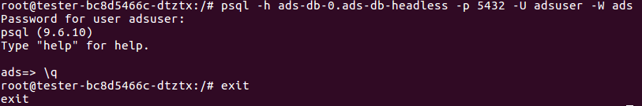

# Exercise 4: Secure your connections

## Scope

Increase security by **establishing a network policy** for Ads DB and **enable TLS** (https) for the **Ingress** for Ads App. 

## Step 0: prerequisites

Test that the kube-system namespace has the proper label: 
```bash
$ kubectl get namespaces --show-labels | grep system
kube-system     Active    20d       name=kube-system
```
If the last value is `<none>` your kube-system namespace is missing the label. In this case talk to the trainers that it gets the label.

## Step 1: Network policy for DB

__Purpose: control traffic to and from *ads:db* pod__ 

We want only that  __ads:db__ only takes messages from __ads:app__. Configure a network policy in a file named `ads-db-networkpolicy.yaml` accordingly. 
You can check the [network policy exercise](/kubernetes/exercise_09_network_policy.md) and [this reference](https://kubernetes.io/docs/concepts/services-networking/network-policies/) on how to write a network policy.  
Also we want to block all outgoing traffic by denying all egress traffic. You can see [here how to do so](https://github.com/ahmetb/kubernetes-network-policy-recipes/blob/master/11-deny-egress-traffic-from-an-application.md).

<details> <summary>If you need further hints here is a skeleton network policy!</summary>
<p>

```yaml
kind: NetworkPolicy
apiVersion: networking.k8s.io/v1
metadata:
  name: ads-db-networkpolicy
  labels:
    <proper-component-module-labels>
spec:
  podSelector:
    matchLabels:
      <labels-for-targeted-entities>
  policyTypes:
  - Ingress
  - Egress  
  ingress:
  - from:
    - podSelector:
        matchLabels:
        <incoming pods labels>
  egress: []
```

</p>
</details>

### Testing of the implemented policy

To test the ingress rule, restart one of your __ads:app__ pods (delete it, the deployment will create a new one). If it comes up the app can still connect to the DB. 
You can also test it by creating a temporary pod with psql installed (e.g. a postgres:9.6 image like our DB) and use psql from this pod to connect to the DB. First we will use the right labels:
```bash
kubectl run --restart=Never -it  --generator=run-pod/v1 --restart=Never --rm --image=postgres:9.6 --labels="component=ads,module=app" --env="PGCONNECT_TIMEOUT=5" helper --command -- /bin/bash
```

A prompt with root@... should come up. You are now connected to the pod, here we can use psql to try to connect to our ads-db:
`psql -h ads-db-statefulset-0.ads-db-service -p 5432 -W ads`. You will be ask for the adsuser pw (you defined that in the initdb.sql script, should be `initial`). After this you should connect to the ads db, a prompt `ads=>` will ask you for the next command. Type `\q` to quit psql since we only wanted to test that we can connect. Also exit the pod with the `exit` command.

<p align="center"></p>

To test that no one else can connect, change the labels in the kubectl command to anything different (or just leave them out) and repeat the steps above: `kubectl run tester -it --generator=run-pod/v1 --restart=Never --rm --image=postgres:9.6 --env="PGCONNECT_TIMEOUT=5" --command -- bash`. Again you should get a root prompt, execute `psql -h ads-db-statefulset-0.ads-db-service -p 5432 -U adsuser -W ads` which, after you entered the password, should return with `timeout expired` after 5 seconds.

To test the egress `kubectl exec -it ads-db-statefulset-0 bash` and try to "ping" any page/pod e.g. `wget <service of ads:app>/api/v1/ads` or `wget google.de`. Both should fail. If `wget` is not there, try e.g. `apt-get update`. This will also timeout.

## Step 2: Network policy for Ads

__Purpose: control traffic to and from *ads:app* pod, learn how to select a pod in a different namespace in your policy__ 

We want that __ads:app__ only takes messages from the ingress. 
The ingress controller is in the `kube-system` namespace and has the following labels you can use: 
```yaml
app: nginx-ingress 
component: controller 
origin: gardener
```
Further we can also allow  __ads:app__ to send traffic only to certain pods. This would be __ads:db__ and the DNS server in our cluster, as well as the reviews service. This DNS server is also in the `kube-system` namespace and has a label `k8s-app: kube-dns`. But again since the reviews service is not yet running we will tackle the egress rules later on. For now we will just restrict the ingress traffic.

Configure a network policy in a file named `ads-app-networkpolicy.yaml` accordingly.

## Step 3: TLS

We also want to enable TLS for our communication with ads. Therefore we activate TLS on our ingress service. 
We could go ahead a create a custom certificate and use it, like we have done in an earlier exercise, but we can also leverage on a gardener feature.

To secure an ingress we need to configure the ingress resource and provide a secret containing the certificate. 
Gardener has implemented a controller which is automatically looking for ingress resources with the label `garden.sapcloud.io/purpose: managed-cert`, creates trusted certificates for them using `Let'sEncrypt` and putting those into secrets. The only thing we have to do configure the ingress and wait for the controller to do its work.

Sadly this feature is limited to urls with less than 64 characters. Or to be more precise we need at least one url with less than 64 characters.
Let us use a four letter hostname: A `b` for "bulletinboard", a `a` for "ads" and the last two digits of your participant number. 
Hence we get for example `br40.ingress.cw43.k8s-train.shoot.canary.k8s-hana.ondemand.com` when your participant number is `part-0040` and the cluster name is `cw43`

Now configure the yaml accordingly. For the secret-name you can choose anything you like, the controller will pick it up and generate the required secret with the given name.
Don't forget to put in the necessary label!

```yaml
apiVersion: networking.k8s.io/v1beta1
kind: Ingress
metadata:
  name: ads-app-ingress
  labels:
    ...
spec:
  rules:
  - host: <short-hostname>.ingress.<your-trainings-cluster>.<your-project-name>.shoot.canary.k8s-hana.ondemand.com
    http:
      paths:
      - path: /
        backend:
          serviceName: ads-app-service
          servicePort: ads-app-port
  - host: <long-hostname>.ingress.<your-trainings-cluster>.<your-project-name>.shoot.canary.k8s-hana.ondemand.com
    http:
      paths:
      - path: /
        backend:
          serviceName: ads-app-service
          servicePort: ads-app-port
  tls:
    - hosts:
      - <short-hostname>.ingress.<your-trainings-cluster>.<your-project-name>.shoot.canary.k8s-hana.ondemand.com
      - <long-hostname>.ingress.<your-trainings-cluster>.<your-project-name>.shoot.canary.k8s-hana.ondemand.com
      secretName: <secret-name>
```
