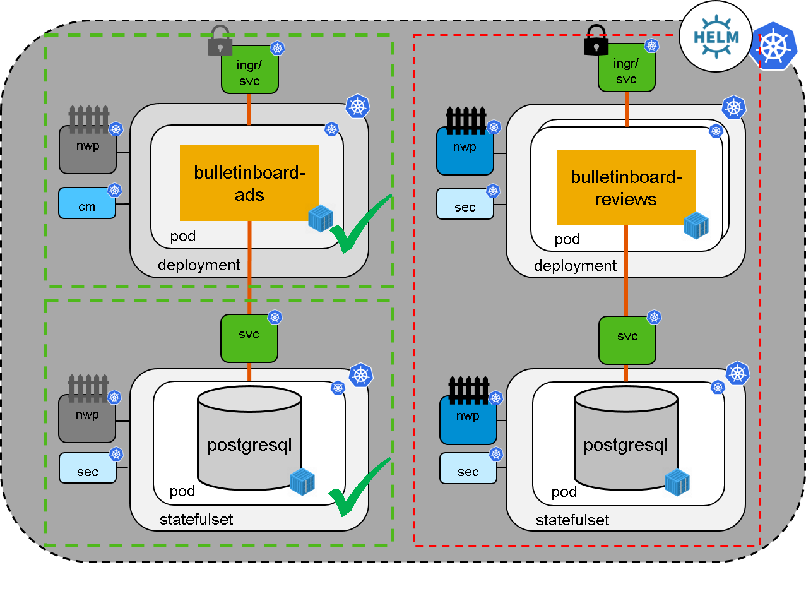

# Exercise 4 - Reviews Service with Helm

## Scope
- In the fourth exercise we will bring up the bulletinboard-reviews service with a provided helm chart (See picture below).



- You only have to edit/insert a few values in a `customValues.yaml`.
- After the Service is running we will finally be able to test our "complete" bulletinboard application.

### Overall purpose:

Get experience with a bit more complex helm chart compared to the helm exercise.
Also it gives us an easy way to setup the user service without you having to write all the yaml files again.

## The helm chart

We provide an almost complete helm chart for the reviews-service: **bulletinboard-reviews-chart.gtz**.
The chart is rather similar to the setup of the bulletinboard-ads but can't be deployed right away.
Some parameters are required:

```
Db.StorageSize (optional - defaults to "512Mi")
App.Image (mandatory)
App.ImagePullSecret (optional - defaults to 'training-registry')
Ingress.Domain: (mandatory)
Ingress.ShortName: (mandatory)
Ingress.LongName: (mandatory)
```

## Step 0: Prerequisites
If you haven't done so already install helm. This was also a prerequisite of the helm exercise.

Go to your project base folder `k8s-bulletinboard`, which you created at the beginning of exercise 2, and create a sub-folder `reviews`.
Download the chart into that folder:

```bash
wget https://github.wdf.sap.corp/slvi/docker-k8s-training/raw/newSampleApp/sample-app/solutions/reviews/bulletinboard-reviews-chart.tgz
```

## Step 1: Helm

Purpose: Get familiar working with an helm chart provided by someone else.

Providing all necessary parameters through the command line is cumbersome.
Therefore create a new file next to the chart-folder called `customValues.yaml` and provide all parameters there.
Remember to use the url that you put in the bulletinboard-ads config as ingress url.

> **Important:** The syntax for helm value files differs from the syntax used above to explain the different parameters. For example `Image` and `ImagePullSecret` should both be nested under the same `App` key.

The parameters `ShortName` and `LongName` are used as a workaround to overcome limitations for the automatic https-certificate creation.
- The `LongName` should be the hostname for the reviews app, which you already specified in the configmap of the bulletinboard ads (`bulletinboard-reviews-<your-participant-number>`).
- The `ShortName` should consists of maximal 4 characters. Let's use `br??`, where the two `?` are the last to digits of you participant number.

If want to know more about this limitation read Step 3 of the next exercise.

Now do `helm install <release-name> bulletinboard-reviews-chart.tgz --values customValues.yaml` in the directory containing the helm-chart-archive and the `customValues.yaml`. (Or adapt the path in command accordingly.)

You can test that the reviews-service is running by executing `kubectl get all -l "component=reviews"`.
The pods should be on state running.

## Step 2: Test Bulletinboard

- Test the running application with a browser, for example follow along the "HappyPath" (Create Ad, View Ad details, Navigate to Reviews, Create Reviews, Observe different colouring in the Ads-UI).

- You might need to disable your ad-blocker to correctly render the UI.

## Troubleshooting tips
- You can extract the tar-ball to see the templates inside the helm chart with `tar --extract --verbose --gunzip --file=bulletinboard-reviews-chart.tgz`
- The reviews chart contains network policies!
- If you encounter difficulties with helm you can use `--dry-run --debug` with the helm install command to view the generated yaml files.
