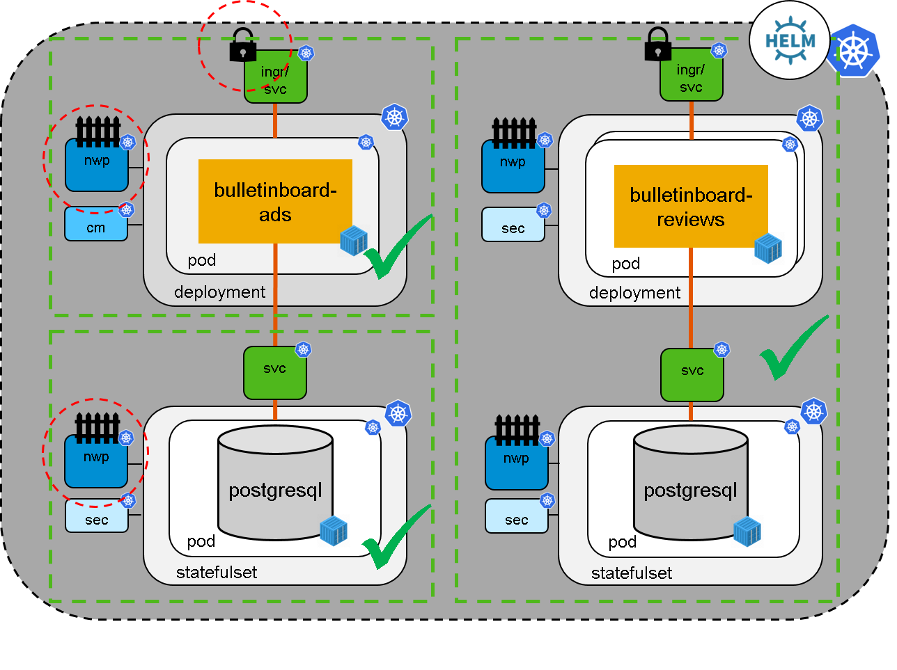

# Exercise 5 - Secure your connections

You have maybe noticed that the helm chart contains already networkpolicies for the reviews app and the database.
Also the ingress is working with TLS encryption.

We want reach this security level for our bulletinboard-ads as well.

## Scope

- In this fifth and last exercise we increase security by **establishing a network policy** for bulletinboard-ads app and database and **enable TLS** (https) for the **Ingress** (See picture below).



## Step 1: Network policy for bulletinboard-ads database

Purpose: control traffic to and from *ads:db* pod

- Specify a **NetworkPolicy** for the **bulletinboard ads database**, with name `ads-db-networkpolicy` and with proper labels and selector for component and module. 

- We want only that  __ads:db__ only takes messages from __ads:app__. Configure the network policy accordingly. 

You can check the [network policy exercise](/kubernetes/exercise_09_network_policy.md) and [this reference](https://kubernetes.io/docs/concepts/services-networking/network-policies/) on how to write a network policy.
Also we want to block all outgoing traffic by denying all egress traffic.
You can see [here how to do so](https://github.com/ahmetb/kubernetes-network-policy-recipes/blob/master/11-deny-egress-traffic-from-an-application.md).

- Save the **Networkpolicy** under the filename `ads-db-networkpolicy.yaml` in folder `k8s-bulletinboard/ads` and apply it with `kubectl apply -f ads-db-networkpolicy.yaml`

<details> <summary>If you need further hints here is a skeleton network policy!</summary>
<p>

```yaml
kind: NetworkPolicy
apiVersion: networking.k8s.io/v1
metadata:
  name: ads-db-networkpolicy
  labels:
    <proper-component-module-labels>
spec:
  podSelector:
    matchLabels:
      <labels-for-targeted-entities>
  policyTypes:
  - Ingress
  - Egress  
  ingress:
  - from:
    - podSelector:
        matchLabels:
        <incoming pods labels>
  egress: []
```

</p>
</details>

### Testing of the implemented policy

To test the ingress rule, create a new ads in the UI. If you can create it without any error the app can still connect to the DB. 
On the other hand create a temporary pod with psql installed (e.g. a postgres:9.6 image like our DB) and use psql from this pod to connect to the DB. First we will use the right labels:

```bash
kubectl run helper -it --restart=Never --rm --image=postgres:9.6 --labels="component=ads,module=app" --env="PGCONNECT_TIMEOUT=5" --command -- bash
```

A prompt with root@... should come up. You are now connected to the pod, here we can use psql to try to connect to our ads-db:
`psql -h ads-db-statefulset-0.ads-db-service -p 5432 -U postgres -W postgres`. You will be ask for the password, which you stored in the ads-db-secret. After this you should connect to the database, a prompt `postgres=>` will ask you for the next command. Type `\q` to quit psql since we only wanted to test that we can connect. Also exit the pod with the `exit` command.

<p align="center"></p>

To test that no one else can connect, change the labels in the kubectl command to anything different (or just leave them out) and repeat the steps above:

```bash
kubectl run helper -it --restart=Never --rm --image=postgres:9.6 --env="PGCONNECT_TIMEOUT=5" --command -- bash
```
Again you should get a root prompt, execute `psql -h ads-db-statefulset-0.ads-db-service -p 5432 -U postgres -W postgres` which, after you entered the password, should return with `timeout expired` after 5 seconds.

To test the egress `kubectl exec -it ads-db-statefulset-0 bash` and try to "ping" any page/pod e.g. `wget google.de`.
It should fail.
If `wget` is not there, try e.g. `apt-get update`.
This will also timeout.

## Step 2: Network policy for bulletinboard-ads app

Purpose: control traffic to and from *ads:app* pod, learn how to select a pod in a different namespace in your policy

- Specify a **NetworkPolicy** for the **bulletinboard ads app**, with name `ads-app-networkpolicy` and with proper labels and selector for component and module. 

- We want that __ads:app__ only takes messages from the ingress-controller. Configure the network policy accordingly. 
The ingress controller is in the `kube-system` namespace and has the following labels you can use: 
```yaml
app: nginx-ingress 
component: controller 
origin: gardener
```

Before we continue with the egress traffic, let us apply the ingress restriction.

- Save the **Networkpolicy** under the filename `ads-app-networkpolicy.yaml` in folder `k8s-bulletinboard/ads` and apply it with `kubectl apply -f ads-app-networkpolicy.yaml`

- Test that everything still works fine.

- Furthermore we want to restrict the egress traffic from __ads:app__ to certain pods only. This would be __ads:db__ and the DNS server in our cluster as well as the reviews service.
  - The DNS server is also in the `kube-system` namespace and has a label `k8s-app: kube-dns`
  - The bulletinboard-reviews
  - The bulletinboard-ads database pod was labeled earlier by ourselves

We have to consider that the bulletinboard-ads connects to the bulletinboard-reviews through the public internet (e.g. https://bulletinboard-reviews-part-0040.ingress.vw43.k8s-train.shoot.canary.k8s-hana.ondemand.com), therefore we cannot simple use a PodSelector here.
But we can use a `ipBlock` to allow egress traffic to the bulletinboard-reviews.

- Find out the IP of the LoadBalancer Service that is publishing the ingress-controller to the internet and use this IP Address in the egress section.

- Again test the bulletinboard, if everything still works.

## Step 3: TLS

We also want to enable TLS for our communication with ads. Therefore we activate TLS on our ingress service. 
We could go ahead a create a custom certificate and use it, like we have done in an earlier exercise, but we can also leverage on a gardener feature.

To secure an ingress we need to configure the ingress resource and provide a secret containing the certificate. 
Gardener has implemented a controller which is automatically looking for ingress resources with the label `garden.sapcloud.io/purpose: managed-cert`, creates trusted certificates for them using `Let'sEncrypt` and putting those into secrets. The only thing we have to do configure the ingress and wait for the controller to do its work.

Sadly this feature is limited to urls with less than 64 characters. Or to be more precise we need at least one url with less than 64 characters.
Let us use a four letter hostname: A `b` for "bulletinboard", a `a` for "ads" and the last two digits of your participant number. 
Hence we get for example `br40.ingress.cw43.k8s-train.shoot.canary.k8s-hana.ondemand.com` when your participant number is `part-0040` and the cluster name is `cw43`

Now configure the yaml accordingly. For the secret-name you can choose anything you like, the controller will pick it up and generate the required secret with the given name.
Don't forget to put in the necessary label!

```yaml
apiVersion: networking.k8s.io/v1beta1
kind: Ingress
metadata:
  name: ads-app-ingress
  labels:
    ...
spec:
  rules:
  - host: <short-hostname>.ingress.<your-trainings-cluster>.<your-project-name>.shoot.canary.k8s-hana.ondemand.com
    http:
      paths:
      - path: /
        backend:
          serviceName: ads-app-service
          servicePort: ads-app-port
  - host: <long-hostname>.ingress.<your-trainings-cluster>.<your-project-name>.shoot.canary.k8s-hana.ondemand.com
    http:
      paths:
      - path: /
        backend:
          serviceName: ads-app-service
          servicePort: ads-app-port
  tls:
    - hosts:
      - <short-hostname>.ingress.<your-trainings-cluster>.<your-project-name>.shoot.canary.k8s-hana.ondemand.com
      - <long-hostname>.ingress.<your-trainings-cluster>.<your-project-name>.shoot.canary.k8s-hana.ondemand.com
      secretName: <secret-name>
```
